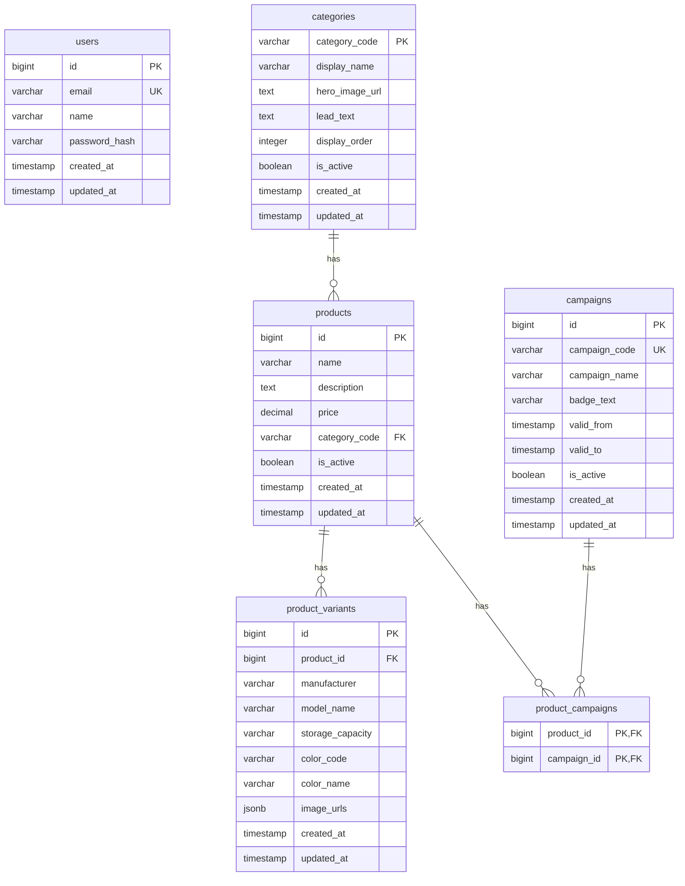
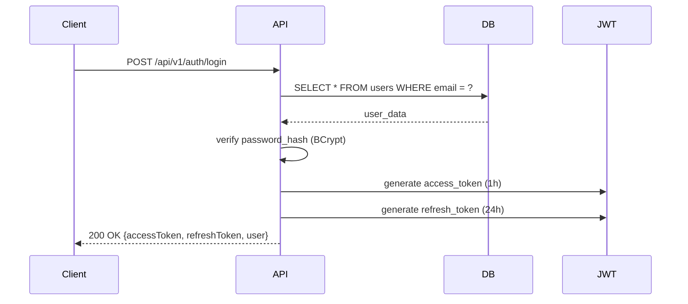
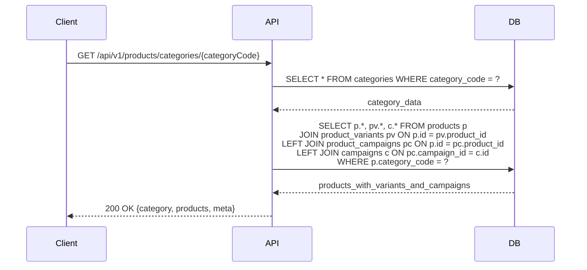

# データモデル文書 / Data Model Document

## メタデータ

| 項目 | 内容 |
|-----|------|
| プロジェクト名 | EC Site Demo |
| サービス名 | ec-site-demo-backend |
| データベース種類 | PostgreSQL 15 |
| 作成日 | 2024-12-14 |
| 作成者 | Devin AI |
| ステータス | approved |
| 関連チケット | EC-276 |

---

## 概要

### データモデルの目的

本データモデルは、ECサイトデモアプリケーションのバックエンドサービスにおけるデータ構造を定義します。以下の機能を実現するためのデータ管理を行います：

- ユーザー認証（JWT認証）
- 商品カテゴリ管理
- 商品情報管理（バリアント含む）
- キャンペーン管理

### スコープ

**対象範囲**:
- ユーザー情報管理（認証用）
- 商品カテゴリ管理
- 商品・商品バリアント管理
- キャンペーン管理

**対象外**:
- 注文管理
- 決済情報
- 配送情報
- 在庫管理

---

## ER図（Entity-Relationship Diagram）

### 全体ER図



**図の説明**:
- **1対多関係**: `categories` → `products`（1カテゴリに複数商品）
- **1対多関係**: `products` → `product_variants`（1商品に複数バリアント）
- **多対多関係**: `products` ↔ `campaigns`（中間テーブル: `product_campaigns`）
- **独立テーブル**: `users`（認証専用、他テーブルとの関連なし）

---

## テーブル定義

### 1. users テーブル

#### 概要
ユーザーアカウント情報を管理するテーブル。JWT認証に使用。

#### スキーマ定義

```sql
CREATE TABLE users (
    id BIGSERIAL PRIMARY KEY,
    email VARCHAR(255) NOT NULL UNIQUE,
    name VARCHAR(255) NOT NULL,
    password_hash VARCHAR(255) NOT NULL,
    created_at TIMESTAMP WITHOUT TIME ZONE DEFAULT CURRENT_TIMESTAMP,
    updated_at TIMESTAMP WITHOUT TIME ZONE DEFAULT CURRENT_TIMESTAMP
);

CREATE INDEX idx_users_email ON users(email);

COMMENT ON TABLE users IS 'ユーザー情報テーブル';
COMMENT ON COLUMN users.id IS 'ユーザーID（主キー）';
COMMENT ON COLUMN users.email IS 'メールアドレス（一意制約、認証に使用）';
COMMENT ON COLUMN users.name IS 'ユーザー名';
COMMENT ON COLUMN users.password_hash IS 'パスワードハッシュ（BCrypt）';
COMMENT ON COLUMN users.created_at IS '作成日時';
COMMENT ON COLUMN users.updated_at IS '更新日時';
```

#### フィールド詳細

| フィールド名 | 型 | NULL許可 | デフォルト | 説明 |
|------------|----|---------:|-----------|------|
| `id` | BIGSERIAL | NO | auto | 主キー、自動採番 |
| `email` | VARCHAR(255) | NO | - | メールアドレス（ユニーク制約） |
| `name` | VARCHAR(255) | NO | - | ユーザー名 |
| `password_hash` | VARCHAR(255) | NO | - | BCryptハッシュ化パスワード |
| `created_at` | TIMESTAMP | YES | CURRENT_TIMESTAMP | 作成日時 |
| `updated_at` | TIMESTAMP | YES | CURRENT_TIMESTAMP | 更新日時 |

#### インデックス設計

| インデックス名 | カラム | タイプ | 目的 |
|-------------|--------|-------|------|
| `PRIMARY KEY` | `id` | B-tree | 主キー検索 |
| `users_email_key` | `email` | B-tree (UNIQUE) | メールアドレスの一意性保証 |
| `idx_users_email` | `email` | B-tree | ログイン時の高速検索 |

---

### 2. categories テーブル

#### 概要
商品カテゴリの基本情報を管理するテーブル。iPhone、Android、リユース品、アクセサリなどのカテゴリを表す。

#### スキーマ定義

```sql
CREATE TABLE categories (
    category_code VARCHAR(50) PRIMARY KEY,
    display_name VARCHAR(100) NOT NULL,
    hero_image_url TEXT,
    lead_text TEXT,
    display_order INTEGER NOT NULL DEFAULT 0,
    is_active BOOLEAN NOT NULL DEFAULT true,
    created_at TIMESTAMP NOT NULL DEFAULT CURRENT_TIMESTAMP,
    updated_at TIMESTAMP NOT NULL DEFAULT CURRENT_TIMESTAMP
);

CREATE INDEX idx_categories_display_order ON categories(display_order);
CREATE INDEX idx_categories_is_active ON categories(is_active);
```

#### フィールド詳細

| フィールド名 | 型 | NULL許可 | デフォルト | 説明 |
|------------|----|---------:|-----------|------|
| `category_code` | VARCHAR(50) | NO | - | カテゴリコード（主キー） |
| `display_name` | VARCHAR(100) | NO | - | 表示名 |
| `hero_image_url` | TEXT | YES | NULL | ヒーロー画像URL |
| `lead_text` | TEXT | YES | NULL | リードテキスト |
| `display_order` | INTEGER | NO | 0 | 表示順序 |
| `is_active` | BOOLEAN | NO | true | 有効フラグ |
| `created_at` | TIMESTAMP | NO | CURRENT_TIMESTAMP | 作成日時 |
| `updated_at` | TIMESTAMP | NO | CURRENT_TIMESTAMP | 更新日時 |

#### インデックス設計

| インデックス名 | カラム | タイプ | 目的 |
|-------------|--------|-------|------|
| `PRIMARY KEY` | `category_code` | B-tree | 主キー検索 |
| `idx_categories_display_order` | `display_order` | B-tree | 表示順ソート |
| `idx_categories_is_active` | `is_active` | B-tree | アクティブカテゴリのフィルタ |

#### 初期データ

```sql
INSERT INTO categories (category_code, display_name, display_order) VALUES 
('iphone', 'iPhone', 1),
('android', 'Android', 2),
('refurbished', 'ドコモ認定リユース品', 3),
('accessories', 'アクセサリ', 4);
```

---

### 3. products テーブル

#### 概要
商品の基本情報を管理するテーブル。カテゴリとの関連を持つ。

#### スキーマ定義

```sql
CREATE TABLE products (
    id BIGSERIAL PRIMARY KEY,
    name VARCHAR(200) NOT NULL,
    description TEXT,
    price DECIMAL(10, 2) NOT NULL,
    category_code VARCHAR(50) NOT NULL,
    is_active BOOLEAN NOT NULL DEFAULT true,
    created_at TIMESTAMP NOT NULL DEFAULT CURRENT_TIMESTAMP,
    updated_at TIMESTAMP NOT NULL DEFAULT CURRENT_TIMESTAMP,
    FOREIGN KEY (category_code) REFERENCES categories(category_code)
);

CREATE INDEX idx_products_category_code ON products(category_code);
CREATE INDEX idx_products_is_active ON products(is_active);
CREATE INDEX idx_products_name ON products(name);
```

#### フィールド詳細

| フィールド名 | 型 | NULL許可 | デフォルト | 説明 |
|------------|----|---------:|-----------|------|
| `id` | BIGSERIAL | NO | auto | 商品ID（主キー） |
| `name` | VARCHAR(200) | NO | - | 商品名 |
| `description` | TEXT | YES | NULL | 商品説明 |
| `price` | DECIMAL(10,2) | NO | - | 価格 |
| `category_code` | VARCHAR(50) | NO | - | カテゴリコード（外部キー） |
| `is_active` | BOOLEAN | NO | true | 有効フラグ |
| `created_at` | TIMESTAMP | NO | CURRENT_TIMESTAMP | 作成日時 |
| `updated_at` | TIMESTAMP | NO | CURRENT_TIMESTAMP | 更新日時 |

#### インデックス設計

| インデックス名 | カラム | タイプ | 目的 |
|-------------|--------|-------|------|
| `PRIMARY KEY` | `id` | B-tree | 主キー検索 |
| `idx_products_category_code` | `category_code` | B-tree | カテゴリ別商品検索 |
| `idx_products_is_active` | `is_active` | B-tree | アクティブ商品のフィルタ |
| `idx_products_name` | `name` | B-tree | 商品名検索 |

#### 外部キー制約

| 制約名 | カラム | 参照テーブル | 参照カラム |
|-------|--------|------------|-----------|
| `products_category_code_fkey` | `category_code` | `categories` | `category_code` |

---

### 4. product_variants テーブル

#### 概要
商品のバリエーション情報を管理するテーブル。ストレージ容量、カラー、メーカー、モデル名などを保持。

#### スキーマ定義

```sql
CREATE TABLE product_variants (
    id BIGSERIAL PRIMARY KEY,
    product_id BIGINT NOT NULL,
    manufacturer VARCHAR(100),
    model_name VARCHAR(200),
    storage_capacity VARCHAR(50),
    color_code VARCHAR(20),
    color_name VARCHAR(50),
    image_urls JSONB,
    created_at TIMESTAMP NOT NULL DEFAULT CURRENT_TIMESTAMP,
    updated_at TIMESTAMP NOT NULL DEFAULT CURRENT_TIMESTAMP,
    FOREIGN KEY (product_id) REFERENCES products(id)
);

CREATE INDEX idx_product_variants_product_id ON product_variants(product_id);
```

#### フィールド詳細

| フィールド名 | 型 | NULL許可 | デフォルト | 説明 |
|------------|----|---------:|-----------|------|
| `id` | BIGSERIAL | NO | auto | バリアントID（主キー） |
| `product_id` | BIGINT | NO | - | 商品ID（外部キー） |
| `manufacturer` | VARCHAR(100) | YES | NULL | メーカー名 |
| `model_name` | VARCHAR(200) | YES | NULL | モデル名 |
| `storage_capacity` | VARCHAR(50) | YES | NULL | ストレージ容量 |
| `color_code` | VARCHAR(20) | YES | NULL | カラーコード |
| `color_name` | VARCHAR(50) | YES | NULL | カラー名 |
| `image_urls` | JSONB | YES | NULL | 画像URL配列（JSON形式） |
| `created_at` | TIMESTAMP | NO | CURRENT_TIMESTAMP | 作成日時 |
| `updated_at` | TIMESTAMP | NO | CURRENT_TIMESTAMP | 更新日時 |

#### インデックス設計

| インデックス名 | カラム | タイプ | 目的 |
|-------------|--------|-------|------|
| `PRIMARY KEY` | `id` | B-tree | 主キー検索 |
| `idx_product_variants_product_id` | `product_id` | B-tree | 商品別バリアント検索 |

#### 外部キー制約

| 制約名 | カラム | 参照テーブル | 参照カラム |
|-------|--------|------------|-----------|
| `product_variants_product_id_fkey` | `product_id` | `products` | `id` |

---

### 5. campaigns テーブル

#### 概要
商品に適用されるキャンペーン情報を管理するテーブル。バッジテキストや有効期間などを保持。

#### スキーマ定義

```sql
CREATE TABLE campaigns (
    id BIGSERIAL PRIMARY KEY,
    campaign_code VARCHAR(100) UNIQUE NOT NULL,
    campaign_name VARCHAR(200) NOT NULL,
    badge_text VARCHAR(100),
    valid_from TIMESTAMP,
    valid_to TIMESTAMP,
    is_active BOOLEAN NOT NULL DEFAULT true,
    created_at TIMESTAMP NOT NULL DEFAULT CURRENT_TIMESTAMP,
    updated_at TIMESTAMP NOT NULL DEFAULT CURRENT_TIMESTAMP
);

CREATE INDEX idx_campaigns_campaign_code ON campaigns(campaign_code);
CREATE INDEX idx_campaigns_is_active ON campaigns(is_active);
CREATE INDEX idx_campaigns_valid_period ON campaigns(valid_from, valid_to);
```

#### フィールド詳細

| フィールド名 | 型 | NULL許可 | デフォルト | 説明 |
|------------|----|---------:|-----------|------|
| `id` | BIGSERIAL | NO | auto | キャンペーンID（主キー） |
| `campaign_code` | VARCHAR(100) | NO | - | キャンペーンコード（ユニーク） |
| `campaign_name` | VARCHAR(200) | NO | - | キャンペーン名 |
| `badge_text` | VARCHAR(100) | YES | NULL | バッジテキスト |
| `valid_from` | TIMESTAMP | YES | NULL | 有効開始日時 |
| `valid_to` | TIMESTAMP | YES | NULL | 有効終了日時 |
| `is_active` | BOOLEAN | NO | true | 有効フラグ |
| `created_at` | TIMESTAMP | NO | CURRENT_TIMESTAMP | 作成日時 |
| `updated_at` | TIMESTAMP | NO | CURRENT_TIMESTAMP | 更新日時 |

#### インデックス設計

| インデックス名 | カラム | タイプ | 目的 |
|-------------|--------|-------|------|
| `PRIMARY KEY` | `id` | B-tree | 主キー検索 |
| `campaigns_campaign_code_key` | `campaign_code` | B-tree (UNIQUE) | キャンペーンコードの一意性保証 |
| `idx_campaigns_campaign_code` | `campaign_code` | B-tree | キャンペーンコード検索 |
| `idx_campaigns_is_active` | `is_active` | B-tree | アクティブキャンペーンのフィルタ |
| `idx_campaigns_valid_period` | `valid_from, valid_to` | B-tree | 有効期間検索 |

---

### 6. product_campaigns テーブル（中間テーブル）

#### 概要
商品とキャンペーンの多対多関連を管理する中間テーブル。

#### スキーマ定義

```sql
CREATE TABLE product_campaigns (
    product_id BIGINT NOT NULL,
    campaign_id BIGINT NOT NULL,
    PRIMARY KEY (product_id, campaign_id),
    FOREIGN KEY (product_id) REFERENCES products(id),
    FOREIGN KEY (campaign_id) REFERENCES campaigns(id)
);

CREATE INDEX idx_product_campaigns_campaign_id ON product_campaigns(campaign_id);
```

#### フィールド詳細

| フィールド名 | 型 | NULL許可 | デフォルト | 説明 |
|------------|----|---------:|-----------|------|
| `product_id` | BIGINT | NO | - | 商品ID（複合主キー、外部キー） |
| `campaign_id` | BIGINT | NO | - | キャンペーンID（複合主キー、外部キー） |

#### インデックス設計

| インデックス名 | カラム | タイプ | 目的 |
|-------------|--------|-------|------|
| `PRIMARY KEY` | `product_id, campaign_id` | B-tree | 複合主キー検索 |
| `idx_product_campaigns_campaign_id` | `campaign_id` | B-tree | キャンペーン別商品検索 |

#### 外部キー制約

| 制約名 | カラム | 参照テーブル | 参照カラム |
|-------|--------|------------|-----------|
| `product_campaigns_product_id_fkey` | `product_id` | `products` | `id` |
| `product_campaigns_campaign_id_fkey` | `campaign_id` | `campaigns` | `id` |

---

## データフロー

### ユーザー認証フロー



### 商品カテゴリ取得フロー



---

## パフォーマンス設計

### インデックス戦略

#### 主要クエリとインデックス

| クエリシナリオ | 頻度 | 対象テーブル | 使用インデックス | 期待性能 |
|------------|------|------------|----------------|---------|
| ログイン（メールでユーザー検索） | 高 | `users` | `idx_users_email` | < 10ms |
| カテゴリ一覧取得 | 高 | `categories` | `idx_categories_is_active`, `idx_categories_display_order` | < 10ms |
| カテゴリ別商品検索 | 高 | `products` | `idx_products_category_code`, `idx_products_is_active` | < 50ms |
| 商品バリアント取得 | 中 | `product_variants` | `idx_product_variants_product_id` | < 20ms |
| キャンペーン適用商品検索 | 中 | `product_campaigns` | `idx_product_campaigns_campaign_id` | < 30ms |

### データ量見積もり

| テーブル | 想定レコード数 | 1レコードサイズ | 総サイズ見積もり |
|---------|--------------|---------------|----------------|
| `users` | 10,000 | 500 bytes | 5 MB |
| `categories` | 10 | 500 bytes | 5 KB |
| `products` | 1,000 | 300 bytes | 300 KB |
| `product_variants` | 5,000 | 500 bytes | 2.5 MB |
| `campaigns` | 100 | 300 bytes | 30 KB |
| `product_campaigns` | 2,000 | 16 bytes | 32 KB |

---

## マイグレーション履歴

| バージョン | ファイル名 | 説明 | 作成日 |
|-----------|-----------|------|--------|
| V001 | V001__Create_Categories.sql | カテゴリテーブル作成、初期データ投入 | 2024-12-14 |
| V002 | V002__Create_Products_And_Variants.sql | 商品・バリアントテーブル作成 | 2024-12-14 |
| V003 | V003__Create_Campaigns.sql | キャンペーン・商品キャンペーン関連テーブル作成 | 2024-12-14 |
| V004 | V004__Create_Users.sql | ユーザーテーブル作成 | 2024-12-14 |

---

## 関連ドキュメント

- [認証API仕様書](../../04_api/endpoints/EP001_auth_api.md)
- [商品カテゴリAPI仕様書](../../04_api/endpoints/EP002_product_api.md)
- [認証モジュール設計書](../../06_implementation/module_specifications/MS001_auth_module.md)
- [商品カテゴリモジュール設計書](../../06_implementation/module_specifications/MS002_product_module.md)
- [OpenAPI仕様書](../../04_api/openapi/openapi.yaml)

---

## 変更履歴

| バージョン | 日付 | 変更者 | 変更内容 |
|-----------|------|--------|---------|
| 1.0.0 | 2024-12-14 | Devin AI | 初版作成 |
