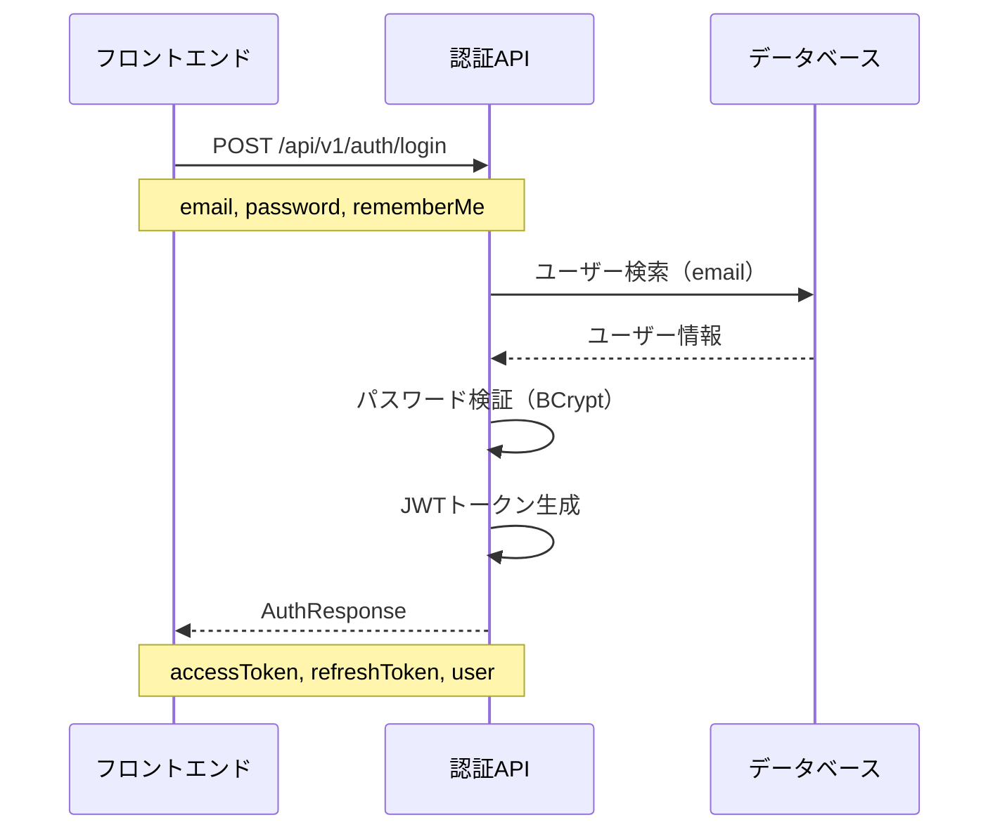

# 認証API仕様書

> ユーザー認証機能を提供するREST APIの仕様書。JWT（JSON Web Token）ベースの認証を実装。

**API Version**: v1.0.0  
**Document Version**: 1.0.0  
**Last Updated**: 2025-12-14  
**Status**: Approved

---

## 目次

1. [概要](#概要)
2. [認証](#認証)
3. [エンドポイント](#エンドポイント)
4. [データモデル](#データモデル)
5. [エラーコード](#エラーコード)
6. [レート制限](#レート制限)
7. [バージョニング](#バージョニング)
8. [変更履歴](#変更履歴)

---

## 概要

### APIの目的

認証APIは、ECサイトのユーザー認証機能を提供します。メールアドレスとパスワードによるログイン認証を行い、JWT形式のアクセストークンとリフレッシュトークンを発行します。

### ベースURL

- **Production**: `https://api.ec-site.example.com/api/v1`
- **Staging**: `https://staging-api.ec-site.example.com/api/v1`
- **Development**: `http://localhost:8080/api/v1`

### プロトコル

- **Protocol**: HTTPS (TLS 1.2+)
- **Content-Type**: `application/json`
- **Character Encoding**: UTF-8

---

## 認証

### 認証方式

このAPIは **JWT (JSON Web Token)** を使用した認証をサポートしています。

#### JWTトークン構造

```
Header: {
  "alg": "HS256",
  "typ": "JWT"
}

Payload: {
  "sub": "user@example.com",  // ユーザーのメールアドレス
  "iat": 1702500000,          // 発行日時（Unix timestamp）
  "exp": 1702503600           // 有効期限（Unix timestamp）
}
```

#### トークン有効期限

| トークン種別 | 通常時 | rememberMe有効時 |
|-------------|--------|-----------------|
| アクセストークン | 1時間（3600秒） | 7日間（604800秒） |
| リフレッシュトークン | 24時間（86400秒） | 24時間（86400秒） |

#### 認証フロー



---

## エンドポイント

### ユーザーログイン

**エンドポイント**: `POST /api/v1/auth/login`

**説明**: メールアドレスとパスワードでユーザーを認証し、JWTトークンを返却します。

**認証**: 不要（公開エンドポイント）

#### リクエストボディ

```json
{
  "email": "user@example.com",
  "password": "password123",
  "rememberMe": false
}
```

#### バリデーション

| フィールド | 型 | 必須 | ルール |
|----------|-----|------|--------|
| email | string | Yes | 必須、有効なメールアドレス形式 |
| password | string | Yes | 必須、6〜100文字 |
| rememberMe | boolean | No | デフォルト: false |

#### リクエスト例

```bash
curl -X POST "http://localhost:8080/api/v1/auth/login" \
  -H "Content-Type: application/json" \
  -d '{
    "email": "user@example.com",
    "password": "password123",
    "rememberMe": true
  }'
```

#### レスポンス: `200 OK`

```json
{
  "accessToken": "eyJhbGciOiJIUzI1NiIsInR5cCI6IkpXVCJ9.eyJzdWIiOiJ1c2VyQGV4YW1wbGUuY29tIiwiaWF0IjoxNzAyNTAwMDAwLCJleHAiOjE3MDI1MDM2MDB9.xxxxx",
  "refreshToken": "eyJhbGciOiJIUzI1NiIsInR5cCI6IkpXVCJ9.eyJzdWIiOiJ1c2VyQGV4YW1wbGUuY29tIiwiaWF0IjoxNzAyNTAwMDAwLCJleHAiOjE3MDI1ODY0MDB9.xxxxx",
  "tokenType": "Bearer",
  "expiresIn": 604800,
  "user": {
    "id": "1",
    "name": "山田太郎",
    "email": "user@example.com"
  }
}
```

#### エラーレスポンス

**400 Bad Request** - バリデーションエラー

```json
{
  "timestamp": "2025-12-14T10:00:00.000+00:00",
  "status": 400,
  "error": "Bad Request",
  "message": "メールアドレスは必須です",
  "path": "/api/v1/auth/login"
}
```

**401 Unauthorized** - 認証失敗

```json
{
  "timestamp": "2025-12-14T10:00:00.000+00:00",
  "status": 401,
  "error": "Unauthorized",
  "message": "認証情報が無効です",
  "path": "/api/v1/auth/login"
}
```

---

## データモデル

### LoginRequest

ログインリクエストのデータモデル。

```json
{
  "email": "string",
  "password": "string",
  "rememberMe": "boolean"
}
```

| フィールド | 型 | 必須 | 説明 |
|----------|-----|------|------|
| email | string | Yes | ユーザーのメールアドレス |
| password | string | Yes | パスワード（6〜100文字） |
| rememberMe | boolean | No | ログイン状態を保持するフラグ（デフォルト: false） |

### AuthResponse

認証成功時のレスポンスデータモデル。

```json
{
  "accessToken": "string",
  "refreshToken": "string",
  "tokenType": "string",
  "expiresIn": "number",
  "user": "UserResponse"
}
```

| フィールド | 型 | 必須 | 説明 |
|----------|-----|------|------|
| accessToken | string | Yes | JWTアクセストークン |
| refreshToken | string | Yes | JWTリフレッシュトークン |
| tokenType | string | Yes | トークンタイプ（常に "Bearer"） |
| expiresIn | number | Yes | アクセストークンの有効期限（秒） |
| user | UserResponse | Yes | ユーザー情報 |

### UserResponse

ユーザー情報のデータモデル。

```json
{
  "id": "string",
  "name": "string",
  "email": "string"
}
```

| フィールド | 型 | 必須 | 説明 |
|----------|-----|------|------|
| id | string | Yes | ユーザーID |
| name | string | Yes | ユーザー名 |
| email | string | Yes | メールアドレス |

---

## エラーコード

### HTTPステータスコード

| コード | 説明 | 使用例 |
|-------|------|--------|
| 200 | OK | ログイン成功 |
| 400 | Bad Request | バリデーションエラー（メールアドレス形式不正、パスワード長不足など） |
| 401 | Unauthorized | 認証失敗（ユーザーが存在しない、パスワード不一致） |
| 500 | Internal Server Error | サーバー内部エラー |

### バリデーションエラーメッセージ

| フィールド | エラー条件 | メッセージ |
|----------|-----------|----------|
| email | 空または未指定 | メールアドレスは必須です |
| email | 形式不正 | 有効なメールアドレス形式で入力してください |
| password | 空または未指定 | パスワードは必須です |
| password | 6文字未満または100文字超過 | パスワードは6文字以上100文字以下で入力してください |

---

## レート制限

### 制限値

| エンドポイント | 制限 | 期間 |
|--------------|------|------|
| POST /api/v1/auth/login | 10リクエスト | 1分間 |

### レート制限超過時のレスポンス

**429 Too Many Requests**

```json
{
  "timestamp": "2025-12-14T10:00:00.000+00:00",
  "status": 429,
  "error": "Too Many Requests",
  "message": "リクエスト制限を超過しました。しばらく待ってから再度お試しください。",
  "path": "/api/v1/auth/login"
}
```

---

## バージョニング

### バージョン管理方針

- APIバージョンはURLパスに含める（例: `/api/v1/auth/login`）
- メジャーバージョン変更時は新しいパスを追加（例: `/api/v2/auth/login`）
- 旧バージョンは最低6ヶ月間サポートを継続

### 現在のバージョン

- **v1**: 現在のアクティブバージョン

---

## セキュリティ考慮事項

### パスワード保存

- パスワードはBCryptアルゴリズムでハッシュ化して保存
- 平文パスワードはログに出力しない

### JWT署名

- HMAC-SHA256アルゴリズムを使用
- シークレットキーは環境変数で管理（Base64エンコード）

### 通信セキュリティ

- 本番環境ではHTTPS必須
- TLS 1.2以上を使用

---

## 関連ドキュメント

- [OpenAPI仕様書（Swagger形式）](../openapi/openapi.yaml) - 機械可読なAPI仕様
- [データモデル文書](../../02_architecture/database/DM001_data_model.md) - データベース設計
- [認証モジュール設計書](../../06_implementation/module_specifications/MS001_auth_module.md) - 実装詳細

---

## 変更履歴

| バージョン | 日付 | 変更者 | 変更内容 |
|-----------|------|--------|---------|
| 1.0.0 | 2025-12-14 | Devin AI | 初版作成 |
| 1.0.1 | 2025-12-14 | Devin AI | OpenAPI仕様書へのリンクを追加 |
