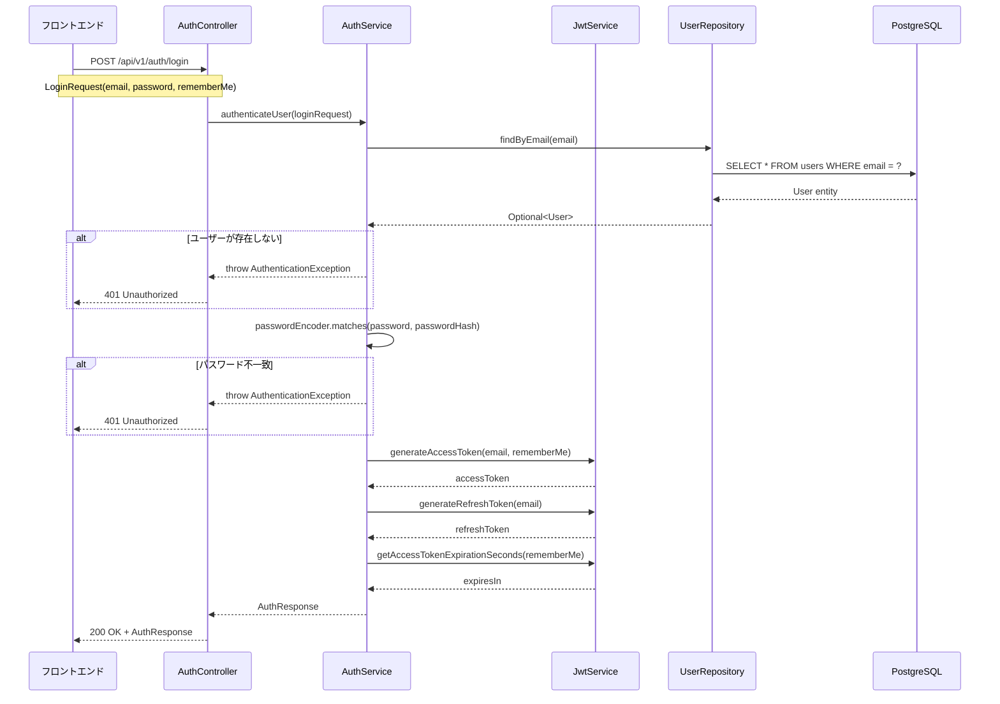

# 認証モジュール設計書

> ECサイトのユーザー認証機能を提供するモジュールの詳細設計書。JWT（JSON Web Token）ベースの認証を実装。

**Document Version**: 1.0.0  
**Last Updated**: 2025-12-14  
**Status**: Approved

---

## 目次

1. [ドキュメント情報](#ドキュメント情報)
2. [概要](#概要)
3. [背景とモチベーション](#背景とモチベーション)
4. [目標と非目標](#目標と非目標)
5. [アーキテクチャ設計](#アーキテクチャ設計)
6. [詳細設計](#詳細設計)
7. [データモデル](#データモデル)
8. [インターフェース設計](#インターフェース設計)
9. [セキュリティ設計](#セキュリティ設計)
10. [エラーハンドリング](#エラーハンドリング)
11. [テスト戦略](#テスト戦略)
12. [変更履歴](#変更履歴)

---

## ドキュメント情報

| 項目 | 内容 |
|------|------|
| ドキュメントID | MS001 |
| タイトル | 認証モジュール設計書 |
| バージョン | 1.0.0 |
| ステータス | Approved |
| 作成者 | Devin AI |
| 作成日 | 2025-12-14 |
| 最終更新日 | 2025-12-14 |
| レビュアー | - |
| 承認者 | - |

### 関連ドキュメント

| ドキュメント | 説明 |
|-------------|------|
| EP001_auth_api.md | 認証API仕様書 |
| system_architecture.md | システムアーキテクチャ |

---

## 概要

### モジュールの目的

認証モジュールは、ECサイトのユーザー認証機能を提供します。メールアドレスとパスワードによるログイン認証を行い、JWT形式のアクセストークンとリフレッシュトークンを発行します。

### 主要機能

1. **ユーザー認証**: メールアドレスとパスワードによる認証
2. **JWTトークン発行**: アクセストークンとリフレッシュトークンの生成
3. **トークン検証**: JWTトークンの有効性検証
4. **rememberMe機能**: ログイン状態の長期保持

### 技術スタック

| 技術 | バージョン | 用途 |
|------|-----------|------|
| Java | 17 | プログラミング言語 |
| Spring Boot | 3.2.0 | アプリケーションフレームワーク |
| Spring Security | 6.x | セキュリティフレームワーク |
| jjwt | 0.11.5 | JWT処理ライブラリ |
| BCrypt | - | パスワードハッシュ化 |
| PostgreSQL | 15 | データベース |

---

## 背景とモチベーション

### 現状の課題

ECサイトにおいて、セキュアで使いやすい認証システムが必要です。以下の要件を満たす必要があります。

1. **セキュリティ**: パスワードの安全な保存、トークンベースの認証
2. **スケーラビリティ**: ステートレスな認証でマイクロサービスに対応
3. **ユーザビリティ**: rememberMe機能による利便性向上

### 解決策

JWT（JSON Web Token）ベースの認証システムを採用し、以下の利点を実現します。

- ステートレスな認証によるスケーラビリティ
- トークンの自己完結性による検証の効率化
- リフレッシュトークンによるセキュアなセッション延長

---

## 目標と非目標

### 目標

1. メールアドレスとパスワードによる安全なユーザー認証
2. JWTトークンの発行と検証
3. rememberMe機能によるトークン有効期限の延長
4. BCryptによるパスワードのセキュアな保存

### 非目標

1. ソーシャルログイン（OAuth 2.0）の実装
2. 多要素認証（MFA）の実装
3. パスワードリセット機能の実装
4. ユーザー登録機能の実装

---

## アーキテクチャ設計

### コンポーネント構成

```
┌─────────────────────────────────────────────────────────────┐
│                      API Layer                              │
│  ┌─────────────────────────────────────────────────────┐   │
│  │              AuthController                          │   │
│  │  POST /api/v1/auth/login                            │   │
│  └─────────────────────────────────────────────────────┘   │
└─────────────────────────────────────────────────────────────┘
                           │
                           ▼
┌─────────────────────────────────────────────────────────────┐
│                    Service Layer                            │
│  ┌─────────────────────┐    ┌─────────────────────────┐    │
│  │    AuthService      │    │      JwtService         │    │
│  │  - authenticateUser │    │  - generateAccessToken  │    │
│  │                     │    │  - generateRefreshToken │    │
│  │                     │    │  - validateToken        │    │
│  │                     │    │  - getUsernameFromToken │    │
│  └─────────────────────┘    └─────────────────────────┘    │
└─────────────────────────────────────────────────────────────┘
                           │
                           ▼
┌─────────────────────────────────────────────────────────────┐
│                  Repository Layer                           │
│  ┌─────────────────────────────────────────────────────┐   │
│  │              UserRepository                          │   │
│  │  - findByEmail(String email)                        │   │
│  └─────────────────────────────────────────────────────┘   │
└─────────────────────────────────────────────────────────────┘
                           │
                           ▼
┌─────────────────────────────────────────────────────────────┐
│                    Data Layer                               │
│  ┌─────────────────────────────────────────────────────┐   │
│  │              PostgreSQL (users table)                │   │
│  └─────────────────────────────────────────────────────┘   │
└─────────────────────────────────────────────────────────────┘
```

### 認証フロー



---

## 詳細設計

### AuthController

認証エンドポイントを提供するRESTコントローラー。

```java
@RestController
@RequestMapping("/api/v1/auth")
@RequiredArgsConstructor
@Slf4j
public class AuthController {

  private final AuthService authService;

  @PostMapping("/login")
  public ResponseEntity<AuthResponse> login(@Valid @RequestBody LoginRequest loginRequest) {
    log.info("ログインリクエスト受信: email={}", loginRequest.getEmail());
    AuthResponse authResponse = authService.authenticateUser(loginRequest);
    return ResponseEntity.ok(authResponse);
  }
}
```

### AuthService

認証ビジネスロジックを提供するサービスクラス。

```java
@Service
@RequiredArgsConstructor
@Slf4j
public class AuthService {

  private final UserRepository userRepository;
  private final JwtService jwtService;
  private final PasswordEncoder passwordEncoder;

  @Transactional(readOnly = true)
  public AuthResponse authenticateUser(LoginRequest loginRequest) {
    String email = loginRequest.getEmail();
    log.info("ログイン試行: email={}", email);

    // 1. ユーザー検索
    User user = userRepository
        .findByEmail(email)
        .orElseThrow(() -> new AuthenticationException("認証情報が無効です"));

    // 2. パスワード検証
    if (!passwordEncoder.matches(loginRequest.getPassword(), user.getPasswordHash())) {
      log.warn("パスワード不一致: email={}", email);
      throw new AuthenticationException("認証情報が無効です");
    }

    // 3. トークン生成
    boolean rememberMe = loginRequest.isRememberMe();
    String accessToken = jwtService.generateAccessToken(email, rememberMe);
    String refreshToken = jwtService.generateRefreshToken(email);
    long expiresIn = jwtService.getAccessTokenExpirationSeconds(rememberMe);

    log.info("ログイン成功: email={}, rememberMe={}", email, rememberMe);

    // 4. レスポンス構築
    UserResponse userResponse = UserResponse.builder()
        .id(String.valueOf(user.getId()))
        .name(user.getName())
        .email(user.getEmail())
        .build();

    return AuthResponse.builder()
        .accessToken(accessToken)
        .refreshToken(refreshToken)
        .tokenType("Bearer")
        .expiresIn(expiresIn)
        .user(userResponse)
        .build();
  }
}
```

### JwtService

JWTトークンの生成と検証を行うサービスクラス。

```java
@Service
@RequiredArgsConstructor
@Slf4j
public class JwtService {

  private final JwtConfig jwtConfig;
  private static final long REMEMBER_ME_MULTIPLIER = 7L;

  public String generateAccessToken(String email, boolean rememberMe) {
    long expiration = jwtConfig.getAccessTokenExpiration();
    if (rememberMe) {
      expiration *= REMEMBER_ME_MULTIPLIER;
    }
    return Jwts.builder()
        .subject(email)
        .issuedAt(new Date())
        .expiration(new Date(System.currentTimeMillis() + expiration))
        .signWith(getSigningKey())
        .compact();
  }

  public String generateRefreshToken(String email) {
    return Jwts.builder()
        .subject(email)
        .issuedAt(new Date())
        .expiration(new Date(System.currentTimeMillis() + jwtConfig.getRefreshTokenExpiration()))
        .signWith(getSigningKey())
        .compact();
  }

  public boolean validateToken(String token) {
    try {
      Jwts.parser().verifyWith(getSigningKey()).build().parseSignedClaims(token);
      return true;
    } catch (MalformedJwtException | ExpiredJwtException | UnsupportedJwtException | IllegalArgumentException e) {
      log.error("JWTトークン検証エラー: {}", e.getMessage());
      return false;
    }
  }

  public String getUsernameFromToken(String token) {
    return Jwts.parser()
        .verifyWith(getSigningKey())
        .build()
        .parseSignedClaims(token)
        .getPayload()
        .getSubject();
  }

  private SecretKey getSigningKey() {
    byte[] keyBytes = Decoders.BASE64.decode(jwtConfig.getSecret());
    return Keys.hmacShaKeyFor(keyBytes);
  }
}
```

---

## データモデル

### Userエンティティ

```java
@Entity
@Table(name = "users")
@Data
public class User {

  @Id
  @GeneratedValue(strategy = GenerationType.IDENTITY)
  private Long id;

  @Column(unique = true, nullable = false)
  private String email;

  @Column(nullable = false)
  private String name;

  @Column(name = "password_hash", nullable = false)
  private String passwordHash;

  @Column(name = "created_at")
  private LocalDateTime createdAt;

  @Column(name = "updated_at")
  private LocalDateTime updatedAt;
}
```

### usersテーブル

```sql
CREATE TABLE users (
    id BIGSERIAL PRIMARY KEY,
    email VARCHAR(255) NOT NULL UNIQUE,
    name VARCHAR(255) NOT NULL,
    password_hash VARCHAR(255) NOT NULL,
    created_at TIMESTAMP DEFAULT CURRENT_TIMESTAMP,
    updated_at TIMESTAMP DEFAULT CURRENT_TIMESTAMP
);

CREATE INDEX idx_users_email ON users(email);
```

---

## インターフェース設計

### リクエスト/レスポンス

#### LoginRequest

| フィールド | 型 | 必須 | バリデーション |
|----------|-----|------|---------------|
| email | String | Yes | @NotBlank, @Email |
| password | String | Yes | @NotBlank, @Size(min=6, max=100) |
| rememberMe | boolean | No | デフォルト: false |

#### AuthResponse

| フィールド | 型 | 説明 |
|----------|-----|------|
| accessToken | String | JWTアクセストークン |
| refreshToken | String | JWTリフレッシュトークン |
| tokenType | String | トークンタイプ（"Bearer"） |
| expiresIn | Long | 有効期限（秒） |
| user | UserResponse | ユーザー情報 |

#### UserResponse

| フィールド | 型 | 説明 |
|----------|-----|------|
| id | String | ユーザーID |
| name | String | ユーザー名 |
| email | String | メールアドレス |

---

## セキュリティ設計

### パスワード保存

- **アルゴリズム**: BCrypt
- **ストレッチング**: 自動（BCryptのデフォルト）
- **ソルト**: 自動生成（BCryptに組み込み）

```java
@Bean
public PasswordEncoder passwordEncoder() {
    return new BCryptPasswordEncoder();
}
```

### JWT署名

- **アルゴリズム**: HMAC-SHA256
- **シークレットキー**: 環境変数で管理（Base64エンコード）
- **キー長**: 256ビット以上

### トークン有効期限

| トークン種別 | 通常時 | rememberMe有効時 |
|-------------|--------|-----------------|
| アクセストークン | 1時間（3600秒） | 7日間（604800秒） |
| リフレッシュトークン | 24時間（86400秒） | 24時間（86400秒） |

### セキュリティ考慮事項

1. **パスワードの平文保存禁止**: BCryptでハッシュ化
2. **パスワードのログ出力禁止**: ログにはメールアドレスのみ出力
3. **エラーメッセージの統一**: ユーザー存在有無を推測されないよう統一メッセージ
4. **HTTPS必須**: 本番環境ではHTTPS通信を強制
5. **レート制限**: ブルートフォース攻撃対策

---

## エラーハンドリング

### 例外クラス

```java
public class AuthenticationException extends RuntimeException {
    public AuthenticationException(String message) {
        super(message);
    }
}
```

### エラーレスポンス

| HTTPステータス | 条件 | メッセージ |
|--------------|------|----------|
| 400 Bad Request | バリデーションエラー | フィールド固有のメッセージ |
| 401 Unauthorized | 認証失敗 | "認証情報が無効です" |
| 500 Internal Server Error | サーバーエラー | "サーバーエラーが発生しました" |

### GlobalExceptionHandler

```java
@RestControllerAdvice
public class GlobalExceptionHandler {

    @ExceptionHandler(AuthenticationException.class)
    public ResponseEntity<ErrorResponse> handleAuthenticationException(AuthenticationException e) {
        return ResponseEntity.status(HttpStatus.UNAUTHORIZED)
            .body(ErrorResponse.builder()
                .status(401)
                .error("Unauthorized")
                .message(e.getMessage())
                .build());
    }

    @ExceptionHandler(MethodArgumentNotValidException.class)
    public ResponseEntity<ErrorResponse> handleValidationException(MethodArgumentNotValidException e) {
        String message = e.getBindingResult().getFieldErrors().stream()
            .map(FieldError::getDefaultMessage)
            .findFirst()
            .orElse("バリデーションエラー");
        return ResponseEntity.status(HttpStatus.BAD_REQUEST)
            .body(ErrorResponse.builder()
                .status(400)
                .error("Bad Request")
                .message(message)
                .build());
    }
}
```

---

## テスト戦略

### 単体テスト

#### AuthServiceTest

```java
@ExtendWith(MockitoExtension.class)
class AuthServiceTest {

    @Mock
    private UserRepository userRepository;

    @Mock
    private JwtService jwtService;

    @Mock
    private PasswordEncoder passwordEncoder;

    @InjectMocks
    private AuthService authService;

    @Test
    void authenticateUser_正常系_認証成功() {
        // Arrange
        LoginRequest request = new LoginRequest();
        request.setEmail("test@example.com");
        request.setPassword("password123");
        request.setRememberMe(false);

        User user = new User();
        user.setId(1L);
        user.setEmail("test@example.com");
        user.setName("テストユーザー");
        user.setPasswordHash("hashedPassword");

        when(userRepository.findByEmail("test@example.com")).thenReturn(Optional.of(user));
        when(passwordEncoder.matches("password123", "hashedPassword")).thenReturn(true);
        when(jwtService.generateAccessToken("test@example.com", false)).thenReturn("accessToken");
        when(jwtService.generateRefreshToken("test@example.com")).thenReturn("refreshToken");
        when(jwtService.getAccessTokenExpirationSeconds(false)).thenReturn(3600L);

        // Act
        AuthResponse response = authService.authenticateUser(request);

        // Assert
        assertThat(response.getAccessToken()).isEqualTo("accessToken");
        assertThat(response.getRefreshToken()).isEqualTo("refreshToken");
        assertThat(response.getUser().getEmail()).isEqualTo("test@example.com");
    }

    @Test
    void authenticateUser_異常系_ユーザー不存在() {
        // Arrange
        LoginRequest request = new LoginRequest();
        request.setEmail("notfound@example.com");
        request.setPassword("password123");

        when(userRepository.findByEmail("notfound@example.com")).thenReturn(Optional.empty());

        // Act & Assert
        assertThatThrownBy(() -> authService.authenticateUser(request))
            .isInstanceOf(AuthenticationException.class)
            .hasMessage("認証情報が無効です");
    }

    @Test
    void authenticateUser_異常系_パスワード不一致() {
        // Arrange
        LoginRequest request = new LoginRequest();
        request.setEmail("test@example.com");
        request.setPassword("wrongpassword");

        User user = new User();
        user.setPasswordHash("hashedPassword");

        when(userRepository.findByEmail("test@example.com")).thenReturn(Optional.of(user));
        when(passwordEncoder.matches("wrongpassword", "hashedPassword")).thenReturn(false);

        // Act & Assert
        assertThatThrownBy(() -> authService.authenticateUser(request))
            .isInstanceOf(AuthenticationException.class)
            .hasMessage("認証情報が無効です");
    }
}
```

### 統合テスト

```java
@SpringBootTest
@AutoConfigureMockMvc
class AuthApiIntegrationTest {

    @Autowired
    private MockMvc mockMvc;

    @Test
    void login_正常系_認証成功() throws Exception {
        mockMvc.perform(post("/api/v1/auth/login")
                .contentType(MediaType.APPLICATION_JSON)
                .content("{\"email\":\"test@example.com\",\"password\":\"password123\"}"))
            .andExpect(status().isOk())
            .andExpect(jsonPath("$.accessToken").exists())
            .andExpect(jsonPath("$.refreshToken").exists())
            .andExpect(jsonPath("$.tokenType").value("Bearer"));
    }
}
```

---

## 変更履歴

| バージョン | 日付 | 変更者 | 変更内容 |
|-----------|------|--------|---------|
| 1.0.0 | 2025-12-14 | Devin AI | 初版作成 |
