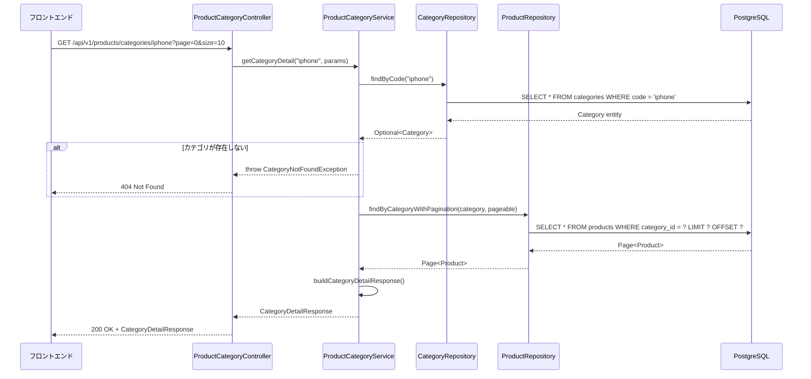

# 商品カテゴリモジュール設計書

> ECサイトの商品カテゴリ管理機能を提供するモジュールの詳細設計書。カテゴリ一覧、カテゴリ詳細、おすすめ商品取得機能を実装。

**Document Version**: 1.0.0  
**Last Updated**: 2025-12-14  
**Status**: Approved

---

## 目次

1. [ドキュメント情報](#ドキュメント情報)
2. [概要](#概要)
3. [背景とモチベーション](#背景とモチベーション)
4. [目標と非目標](#目標と非目標)
5. [アーキテクチャ設計](#アーキテクチャ設計)
6. [詳細設計](#詳細設計)
7. [データモデル](#データモデル)
8. [インターフェース設計](#インターフェース設計)
9. [フロントエンド連携](#フロントエンド連携)
10. [エラーハンドリング](#エラーハンドリング)
11. [テスト戦略](#テスト戦略)
12. [変更履歴](#変更履歴)

---

## ドキュメント情報

| 項目 | 内容 |
|------|------|
| ドキュメントID | MS002 |
| タイトル | 商品カテゴリモジュール設計書 |
| バージョン | 1.0.0 |
| ステータス | Approved |
| 作成者 | Devin AI |
| 作成日 | 2025-12-14 |
| 最終更新日 | 2025-12-14 |
| レビュアー | - |
| 承認者 | - |

### 関連ドキュメント

| ドキュメント | 説明 |
|-------------|------|
| EP002_product_api.md | 商品カテゴリAPI仕様書 |
| system_architecture.md | システムアーキテクチャ |

---

## 概要

### モジュールの目的

商品カテゴリモジュールは、ECサイトの商品カテゴリ情報を管理・提供します。カテゴリ一覧の取得、カテゴリ詳細（商品リスト含む）の取得、おすすめ商品の取得機能を提供します。

### 主要機能

1. **カテゴリ一覧取得**: アクティブなカテゴリの一覧を表示順でソートして返却
2. **カテゴリ詳細取得**: 指定カテゴリの詳細情報と商品リストを返却（ページネーション、検索、ソート対応）
3. **おすすめ商品取得**: カテゴリに関連するおすすめ商品を返却（将来のレコメンデーションサービス連携用）

### 技術スタック

| 技術 | バージョン | 用途 |
|------|-----------|------|
| Java | 17 | プログラミング言語 |
| Spring Boot | 3.2.0 | アプリケーションフレームワーク |
| Spring Data JPA | 3.x | データアクセス |
| PostgreSQL | 15 | データベース |
| Lombok | - | ボイラープレートコード削減 |

---

## 背景とモチベーション

### 現状の課題

ECサイトにおいて、商品カテゴリの効率的な管理と表示が必要です。以下の要件を満たす必要があります。

1. **パフォーマンス**: 大量の商品データを効率的に取得・表示
2. **柔軟性**: キーワード検索、ページネーション、ソート機能
3. **拡張性**: 将来のレコメンデーション機能への対応

### 解決策

Spring Data JPAを活用したリポジトリパターンを採用し、以下の利点を実現します。

- ページネーションによる効率的なデータ取得
- 動的クエリによる柔軟な検索機能
- サービス層の分離によるビジネスロジックの明確化

---

## 目標と非目標

### 目標

1. カテゴリ一覧の効率的な取得
2. カテゴリ詳細と商品リストの取得（ページネーション対応）
3. キーワード検索とソート機能の提供
4. おすすめ商品取得のインターフェース提供

### 非目標

1. 商品の登録・更新・削除機能（管理者機能）
2. カテゴリの登録・更新・削除機能（管理者機能）
3. 在庫管理機能
4. 価格管理機能

---

## アーキテクチャ設計

### コンポーネント構成

```
┌─────────────────────────────────────────────────────────────┐
│                      API Layer                              │
│  ┌─────────────────────────────────────────────────────┐   │
│  │          ProductCategoryController                   │   │
│  │  GET /api/v1/products/categories                    │   │
│  │  GET /api/v1/products/categories/{categoryCode}     │   │
│  │  GET /api/v1/products/categories/{code}/recommendations │
│  └─────────────────────────────────────────────────────┘   │
└─────────────────────────────────────────────────────────────┘
                           │
                           ▼
┌─────────────────────────────────────────────────────────────┐
│                    Service Layer                            │
│  ┌─────────────────────────────────────────────────────┐   │
│  │           ProductCategoryService                     │   │
│  │  - getCategories()                                  │   │
│  │  - getCategoryDetail(categoryCode, params)          │   │
│  │  - getCategoryRecommendations(categoryCode)         │   │
│  └─────────────────────────────────────────────────────┘   │
└─────────────────────────────────────────────────────────────┘
                           │
                           ▼
┌─────────────────────────────────────────────────────────────┐
│                  Repository Layer                           │
│  ┌─────────────────────┐    ┌─────────────────────────┐    │
│  │  CategoryRepository │    │   ProductRepository     │    │
│  │  - findAllActive()  │    │  - findByCategory()     │    │
│  │  - findByCode()     │    │  - searchByKeyword()    │    │
│  └─────────────────────┘    └─────────────────────────┘    │
└─────────────────────────────────────────────────────────────┘
                           │
                           ▼
┌─────────────────────────────────────────────────────────────┐
│                    Data Layer                               │
│  ┌─────────────────────────────────────────────────────┐   │
│  │              PostgreSQL                              │   │
│  │  - categories table                                 │   │
│  │  - products table                                   │   │
│  │  - product_variants table                           │   │
│  │  - campaigns table                                  │   │
│  └─────────────────────────────────────────────────────┘   │
└─────────────────────────────────────────────────────────────┘
```

### カテゴリ詳細取得フロー



---

## 詳細設計

### ProductCategoryController

商品カテゴリエンドポイントを提供するRESTコントローラー。

```java
@RestController
@RequestMapping("/api/v1/products/categories")
@RequiredArgsConstructor
@Slf4j
public class ProductCategoryController {

  private final ProductCategoryService productCategoryService;

  @GetMapping
  public ResponseEntity<CategoryListResponse> getCategories() {
    log.info("カテゴリ一覧取得リクエストを受信しました");
    CategoryListResponse response = productCategoryService.getCategories();
    return ResponseEntity.ok(response);
  }

  @GetMapping("/{categoryCode}")
  public ResponseEntity<CategoryDetailResponse> getCategoryDetail(
      @PathVariable String categoryCode,
      @RequestParam(required = false) String keyword,
      @RequestParam(defaultValue = "0") int page,
      @RequestParam(defaultValue = "20") int size,
      @RequestParam(defaultValue = "name") String sort,
      @RequestParam(defaultValue = "asc") String order) {
    
    log.info("カテゴリ詳細取得リクエスト: categoryCode={}, keyword={}, page={}, size={}",
        categoryCode, keyword, page, size);
    
    CategoryDetailRequest request = CategoryDetailRequest.builder()
        .categoryCode(categoryCode)
        .keyword(keyword)
        .page(page)
        .size(size)
        .sort(sort)
        .order(order)
        .build();
    
    CategoryDetailResponse response = productCategoryService.getCategoryDetail(request);
    return ResponseEntity.ok(response);
  }

  @GetMapping("/{categoryCode}/recommendations")
  public ResponseEntity<CategoryRecommendationResponse> getCategoryRecommendations(
      @PathVariable String categoryCode) {
    
    log.info("おすすめ商品取得リクエスト: categoryCode={}", categoryCode);
    CategoryRecommendationResponse response = 
        productCategoryService.getCategoryRecommendations(categoryCode);
    return ResponseEntity.ok(response);
  }
}
```

### ProductCategoryService

商品カテゴリのビジネスロジックを提供するサービスクラス。

```java
@Service
@RequiredArgsConstructor
@Slf4j
public class ProductCategoryService {

  private final CategoryRepository categoryRepository;
  private final ProductRepository productRepository;

  @Transactional(readOnly = true)
  public CategoryListResponse getCategories() {
    List<Category> categories = categoryRepository.findAllActiveOrderByDisplayOrder();
    
    List<CategorySummary> categorySummaries = categories.stream()
        .map(this::toCategorySummary)
        .collect(Collectors.toList());
    
    return CategoryListResponse.builder()
        .success(true)
        .message("カテゴリ一覧を取得しました")
        .data(categorySummaries)
        .timestamp(Instant.now().toString())
        .requestId(UUID.randomUUID().toString())
        .build();
  }

  @Transactional(readOnly = true)
  public CategoryDetailResponse getCategoryDetail(CategoryDetailRequest request) {
    String categoryCode = request.getCategoryCode();
    
    Category category = categoryRepository.findByCode(categoryCode)
        .orElseThrow(() -> new CategoryNotFoundException(
            "カテゴリが見つかりません: " + categoryCode));
    
    Pageable pageable = createPageable(request);
    Page<Product> productPage;
    
    if (request.getKeyword() != null && !request.getKeyword().isEmpty()) {
      productPage = productRepository.findByCategoryAndKeyword(
          category, request.getKeyword(), pageable);
    } else {
      productPage = productRepository.findByCategory(category, pageable);
    }
    
    return buildCategoryDetailResponse(category, productPage);
  }

  @Transactional(readOnly = true)
  public CategoryRecommendationResponse getCategoryRecommendations(String categoryCode) {
    // カテゴリの存在確認
    categoryRepository.findByCode(categoryCode)
        .orElseThrow(() -> new CategoryNotFoundException(
            "カテゴリが見つかりません: " + categoryCode));
    
    // TODO: ec-site-recommendation-serviceとの連携実装
    // 現在は空のリストを返却
    log.info("おすすめ商品取得: categoryCode={} - レコメンデーションサービス未実装のため空リスト返却",
        categoryCode);
    
    return CategoryRecommendationResponse.builder()
        .success(true)
        .message("おすすめ商品を取得しました（現在おすすめ商品はありません）")
        .data(RecommendationData.builder()
            .recommendations(Collections.emptyList())
            .build())
        .timestamp(Instant.now().toString())
        .requestId(UUID.randomUUID().toString())
        .build();
  }

  private Pageable createPageable(CategoryDetailRequest request) {
    Sort.Direction direction = "desc".equalsIgnoreCase(request.getOrder()) 
        ? Sort.Direction.DESC 
        : Sort.Direction.ASC;
    Sort sort = Sort.by(direction, request.getSort());
    return PageRequest.of(request.getPage(), request.getSize(), sort);
  }

  private CategorySummary toCategorySummary(Category category) {
    return CategorySummary.builder()
        .categoryCode(category.getCode())
        .displayName(category.getDisplayName())
        .heroImageUrl(category.getHeroImageUrl())
        .leadText(category.getLeadText())
        .productCount(category.getProductCount())
        .build();
  }

  private CategoryDetailResponse buildCategoryDetailResponse(
      Category category, Page<Product> productPage) {
    
    CategoryInfo categoryInfo = CategoryInfo.builder()
        .categoryCode(category.getCode())
        .displayName(category.getDisplayName())
        .heroImageUrl(category.getHeroImageUrl())
        .leadText(category.getLeadText())
        .build();
    
    List<ProductItem> products = productPage.getContent().stream()
        .map(this::toProductItem)
        .collect(Collectors.toList());
    
    Pagination pagination = Pagination.builder()
        .page(productPage.getNumber())
        .perPage(productPage.getSize())
        .total((int) productPage.getTotalElements())
        .pages(productPage.getTotalPages())
        .build();
    
    return CategoryDetailResponse.builder()
        .success(true)
        .message("カテゴリ詳細を取得しました")
        .data(CategoryDetailData.builder()
            .category(categoryInfo)
            .products(products)
            .meta(Meta.builder().pagination(pagination).build())
            .build())
        .timestamp(Instant.now().toString())
        .requestId(UUID.randomUUID().toString())
        .build();
  }

  private ProductItem toProductItem(Product product) {
    return ProductItem.builder()
        .productId(product.getId())
        .productName(product.getName())
        .description(product.getDescription())
        .price(product.getPrice())
        .manufacturer(product.getManufacturer())
        .modelName(product.getModelName())
        .storageCapacity(product.getStorageCapacity())
        .colorCode(product.getColorCode())
        .colorName(product.getColorName())
        .imageUrls(product.getImageUrls())
        .campaigns(product.getCampaigns().stream()
            .map(c -> CampaignBadge.builder()
                .campaignCode(c.getCampaignCode())
                .badgeText(c.getBadgeText())
                .build())
            .collect(Collectors.toList()))
        .build();
  }
}
```

---

## データモデル

### Categoryエンティティ

```java
@Entity
@Table(name = "categories")
@Data
public class Category {

  @Id
  @GeneratedValue(strategy = GenerationType.IDENTITY)
  private Long id;

  @Column(unique = true, nullable = false)
  private String code;

  @Column(name = "display_name", nullable = false)
  private String displayName;

  @Column(name = "hero_image_url")
  private String heroImageUrl;

  @Column(name = "lead_text")
  private String leadText;

  @Column(name = "display_order")
  private Integer displayOrder;

  @Column(name = "is_active")
  private Boolean isActive;

  @Column(name = "product_count")
  private Integer productCount;

  @Column(name = "created_at")
  private LocalDateTime createdAt;

  @Column(name = "updated_at")
  private LocalDateTime updatedAt;
}
```

### Productエンティティ

```java
@Entity
@Table(name = "products")
@Data
public class Product {

  @Id
  @GeneratedValue(strategy = GenerationType.IDENTITY)
  private Long id;

  @Column(nullable = false)
  private String name;

  @Column(columnDefinition = "TEXT")
  private String description;

  @Column(nullable = false)
  private BigDecimal price;

  private String manufacturer;

  @Column(name = "model_name")
  private String modelName;

  @Column(name = "storage_capacity")
  private String storageCapacity;

  @Column(name = "color_code")
  private String colorCode;

  @Column(name = "color_name")
  private String colorName;

  @ManyToOne(fetch = FetchType.LAZY)
  @JoinColumn(name = "category_id")
  private Category category;

  @ElementCollection
  @CollectionTable(name = "product_images", joinColumns = @JoinColumn(name = "product_id"))
  @Column(name = "image_url")
  private List<String> imageUrls;

  @ManyToMany
  @JoinTable(
      name = "product_campaigns",
      joinColumns = @JoinColumn(name = "product_id"),
      inverseJoinColumns = @JoinColumn(name = "campaign_id"))
  private List<Campaign> campaigns;

  @Column(name = "created_at")
  private LocalDateTime createdAt;

  @Column(name = "updated_at")
  private LocalDateTime updatedAt;
}
```

### データベーススキーマ

```sql
-- カテゴリテーブル
CREATE TABLE categories (
    id BIGSERIAL PRIMARY KEY,
    code VARCHAR(50) NOT NULL UNIQUE,
    display_name VARCHAR(100) NOT NULL,
    hero_image_url VARCHAR(500),
    lead_text VARCHAR(500),
    display_order INTEGER DEFAULT 0,
    is_active BOOLEAN DEFAULT true,
    product_count INTEGER DEFAULT 0,
    created_at TIMESTAMP DEFAULT CURRENT_TIMESTAMP,
    updated_at TIMESTAMP DEFAULT CURRENT_TIMESTAMP
);

CREATE INDEX idx_categories_code ON categories(code);
CREATE INDEX idx_categories_display_order ON categories(display_order);

-- 商品テーブル
CREATE TABLE products (
    id BIGSERIAL PRIMARY KEY,
    name VARCHAR(200) NOT NULL,
    description TEXT,
    price DECIMAL(12, 2) NOT NULL,
    manufacturer VARCHAR(100),
    model_name VARCHAR(100),
    storage_capacity VARCHAR(50),
    color_code VARCHAR(20),
    color_name VARCHAR(50),
    category_id BIGINT REFERENCES categories(id),
    created_at TIMESTAMP DEFAULT CURRENT_TIMESTAMP,
    updated_at TIMESTAMP DEFAULT CURRENT_TIMESTAMP
);

CREATE INDEX idx_products_category_id ON products(category_id);
CREATE INDEX idx_products_name ON products(name);

-- 商品画像テーブル
CREATE TABLE product_images (
    id BIGSERIAL PRIMARY KEY,
    product_id BIGINT REFERENCES products(id) ON DELETE CASCADE,
    image_url VARCHAR(500) NOT NULL,
    display_order INTEGER DEFAULT 0
);

-- キャンペーンテーブル
CREATE TABLE campaigns (
    id BIGSERIAL PRIMARY KEY,
    campaign_code VARCHAR(50) NOT NULL UNIQUE,
    badge_text VARCHAR(100) NOT NULL,
    valid_from TIMESTAMP,
    valid_to TIMESTAMP,
    is_active BOOLEAN DEFAULT true,
    created_at TIMESTAMP DEFAULT CURRENT_TIMESTAMP
);

-- 商品キャンペーン関連テーブル
CREATE TABLE product_campaigns (
    product_id BIGINT REFERENCES products(id) ON DELETE CASCADE,
    campaign_id BIGINT REFERENCES campaigns(id) ON DELETE CASCADE,
    PRIMARY KEY (product_id, campaign_id)
);
```

---

## インターフェース設計

### リクエスト/レスポンス

#### CategoryListResponse

```java
@Data
@Builder
public class CategoryListResponse {
    private boolean success;
    private String message;
    private List<CategorySummary> data;
    private String timestamp;
    private String requestId;
}
```

#### CategorySummary

| フィールド | 型 | 説明 |
|----------|-----|------|
| categoryCode | String | カテゴリコード |
| displayName | String | 表示名 |
| heroImageUrl | String | ヒーロー画像URL |
| leadText | String | リードテキスト |
| productCount | Integer | 商品数 |

#### CategoryDetailResponse

```java
@Data
@Builder
public class CategoryDetailResponse {
    private boolean success;
    private String message;
    private CategoryDetailData data;
    private String timestamp;
    private String requestId;
}

@Data
@Builder
public class CategoryDetailData {
    private CategoryInfo category;
    private List<ProductItem> products;
    private Meta meta;
}
```

---

## フロントエンド連携

### 静的データとの対応

フロントエンド（ec-site-demo-frontend）では、現在以下の静的カテゴリデータを使用しています。

```typescript
const CATEGORIES = [
  { id: 1, name: 'iPhone', slug: 'iphone', displayOrder: 1 },
  { id: 2, name: 'Android', slug: 'android', displayOrder: 2 },
  { id: 3, name: 'ドコモ認定リユース品', slug: 'docomo-certified', displayOrder: 3 },
  { id: 4, name: 'アクセサリ', slug: 'accessories', displayOrder: 4 }
]
```

### マッピング

| フロントエンド | バックエンドAPI |
|--------------|----------------|
| slug | categoryCode |
| name | displayName |
| displayOrder | displayOrder |

### API連携時の変更点

フロントエンドがバックエンドAPIと連携する際は、以下の変更が必要です。

1. **静的データの削除**: `CATEGORIES`定数を削除
2. **API呼び出しの追加**: `useCategoryProducts`フックでAPIを呼び出し
3. **レスポンスマッピング**: `ProductCardDto`から`Device`型への変換

```typescript
// src/hooks/useCategoryProducts.ts
export function useCategoryProducts(categoryCode: string, options?: Options) {
  return useQuery({
    queryKey: ['categoryProducts', categoryCode, options],
    queryFn: () => getCategoryProducts(categoryCode, options),
    staleTime: 5 * 60 * 1000, // 5分間キャッシュ
  })
}
```

---

## エラーハンドリング

### 例外クラス

```java
public class CategoryNotFoundException extends RuntimeException {
    public CategoryNotFoundException(String message) {
        super(message);
    }
}
```

### エラーレスポンス

| HTTPステータス | 条件 | メッセージ |
|--------------|------|----------|
| 400 Bad Request | パラメータ不正 | バリデーションエラーメッセージ |
| 404 Not Found | カテゴリ不存在 | "カテゴリが見つかりません: {categoryCode}" |
| 500 Internal Server Error | サーバーエラー | "サーバーエラーが発生しました" |

### GlobalExceptionHandler

```java
@RestControllerAdvice
public class GlobalExceptionHandler {

    @ExceptionHandler(CategoryNotFoundException.class)
    public ResponseEntity<ErrorResponse> handleCategoryNotFoundException(
            CategoryNotFoundException e) {
        return ResponseEntity.status(HttpStatus.NOT_FOUND)
            .body(ErrorResponse.builder()
                .status(404)
                .error("Not Found")
                .message(e.getMessage())
                .build());
    }
}
```

---

## テスト戦略

### 単体テスト

#### ProductCategoryServiceTest

```java
@ExtendWith(MockitoExtension.class)
class ProductCategoryServiceTest {

    @Mock
    private CategoryRepository categoryRepository;

    @Mock
    private ProductRepository productRepository;

    @InjectMocks
    private ProductCategoryService productCategoryService;

    @Test
    void getCategories_正常系_カテゴリ一覧取得() {
        // Arrange
        Category category1 = createCategory("iphone", "iPhone", 1);
        Category category2 = createCategory("android", "Android", 2);
        when(categoryRepository.findAllActiveOrderByDisplayOrder())
            .thenReturn(List.of(category1, category2));

        // Act
        CategoryListResponse response = productCategoryService.getCategories();

        // Assert
        assertThat(response.isSuccess()).isTrue();
        assertThat(response.getData()).hasSize(2);
        assertThat(response.getData().get(0).getCategoryCode()).isEqualTo("iphone");
    }

    @Test
    void getCategoryDetail_正常系_カテゴリ詳細取得() {
        // Arrange
        Category category = createCategory("iphone", "iPhone", 1);
        Product product = createProduct("iPhone 15 Pro", category);
        Page<Product> productPage = new PageImpl<>(List.of(product));

        when(categoryRepository.findByCode("iphone")).thenReturn(Optional.of(category));
        when(productRepository.findByCategory(eq(category), any(Pageable.class)))
            .thenReturn(productPage);

        CategoryDetailRequest request = CategoryDetailRequest.builder()
            .categoryCode("iphone")
            .page(0)
            .size(20)
            .sort("name")
            .order("asc")
            .build();

        // Act
        CategoryDetailResponse response = productCategoryService.getCategoryDetail(request);

        // Assert
        assertThat(response.isSuccess()).isTrue();
        assertThat(response.getData().getCategory().getCategoryCode()).isEqualTo("iphone");
        assertThat(response.getData().getProducts()).hasSize(1);
    }

    @Test
    void getCategoryDetail_異常系_カテゴリ不存在() {
        // Arrange
        when(categoryRepository.findByCode("invalid")).thenReturn(Optional.empty());

        CategoryDetailRequest request = CategoryDetailRequest.builder()
            .categoryCode("invalid")
            .build();

        // Act & Assert
        assertThatThrownBy(() -> productCategoryService.getCategoryDetail(request))
            .isInstanceOf(CategoryNotFoundException.class)
            .hasMessageContaining("カテゴリが見つかりません");
    }
}
```

### 統合テスト

```java
@SpringBootTest
@AutoConfigureMockMvc
class ProductCategoryApiIntegrationTest {

    @Autowired
    private MockMvc mockMvc;

    @Test
    void getCategories_正常系_カテゴリ一覧取得() throws Exception {
        mockMvc.perform(get("/api/v1/products/categories")
                .contentType(MediaType.APPLICATION_JSON))
            .andExpect(status().isOk())
            .andExpect(jsonPath("$.success").value(true))
            .andExpect(jsonPath("$.data").isArray());
    }

    @Test
    void getCategoryDetail_正常系_カテゴリ詳細取得() throws Exception {
        mockMvc.perform(get("/api/v1/products/categories/iphone")
                .param("page", "0")
                .param("size", "10")
                .contentType(MediaType.APPLICATION_JSON))
            .andExpect(status().isOk())
            .andExpect(jsonPath("$.success").value(true))
            .andExpect(jsonPath("$.data.category.categoryCode").value("iphone"));
    }

    @Test
    void getCategoryDetail_異常系_カテゴリ不存在() throws Exception {
        mockMvc.perform(get("/api/v1/products/categories/invalid")
                .contentType(MediaType.APPLICATION_JSON))
            .andExpect(status().isNotFound())
            .andExpect(jsonPath("$.message").value(containsString("カテゴリが見つかりません")));
    }
}
```

---

## 変更履歴

| バージョン | 日付 | 変更者 | 変更内容 |
|-----------|------|--------|---------|
| 1.0.0 | 2025-12-14 | Devin AI | 初版作成 |
