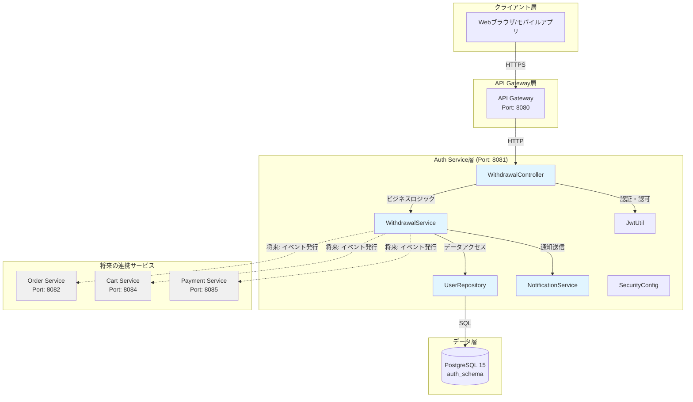
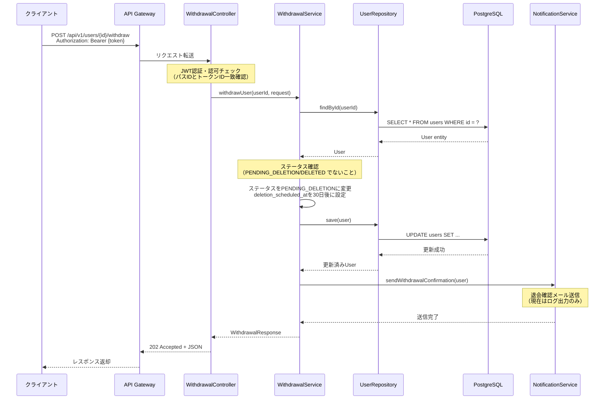
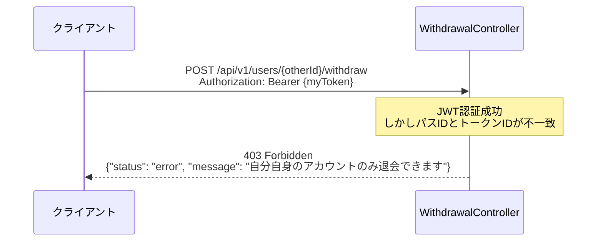

# アーキテクチャ設計書 - ユーザー退会処理機能

## ドキュメント情報
- **プロジェクト**: EC-Site認証サービス
- **チケット**: EC-19
- **作成日**: 2025-11-11
- **バージョン**: 1.0.0
- **ステータス**: 実装完了

## 1. 概要

### 1.1 目的
ユーザー退会処理機能のアーキテクチャ設計を定義し、システム全体の構造と各コンポーネントの役割を明確にする。

### 1.2 設計方針
- **既存サービスの拡張**: 新規サービスを作成せず、Auth Serviceを拡張
- **多段階削除**: 誤操作からの復旧を可能にする猶予期間を設ける
- **ステートレス設計**: JWT認証によるスケーラブルなアーキテクチャ
- **マイクロサービス独立性**: 各サービスが独自のデータを管理

## 2. システム構成図



## 3. コンポーネント設計

### 3.1 レイヤー構成

```
┌─────────────────────────────────────┐
│     Presentation Layer              │
│  (Controller, DTO, ErrorHandler)    │
├─────────────────────────────────────┤
│     Business Logic Layer            │
│  (Service, Domain Model)            │
├─────────────────────────────────────┤
│     Data Access Layer               │
│  (Repository, Entity)               │
├─────────────────────────────────────┤
│     Infrastructure Layer            │
│  (Database, Security, Config)       │
└─────────────────────────────────────┘
```

### 3.2 主要コンポーネント

#### 3.2.1 WithdrawalController
- **責務**: HTTPリクエストの受付とレスポンス返却
- **パッケージ**: `com.ecsite.auth.controller`
- **主要メソッド**:
  - `withdrawUser(UUID id, WithdrawalRequest request)`: 退会処理エンドポイント
- **依存関係**: WithdrawalService

#### 3.2.2 WithdrawalService
- **責務**: 退会処理のビジネスロジック実行
- **パッケージ**: `com.ecsite.auth.service`
- **主要メソッド**:
  - `withdrawUser(UUID userId, WithdrawalRequest request)`: 退会処理実行
  - `sendWithdrawalNotification(User user)`: 退会確認通知送信
  - `buildWithdrawalResponse(User user)`: レスポンスDTO構築
- **依存関係**: UserRepository, NotificationService

#### 3.2.3 UserRepository
- **責務**: Userエンティティのデータアクセス
- **パッケージ**: `com.ecsite.auth.repository`
- **技術**: Spring Data JPA
- **主要メソッド**:
  - `findById(UUID id)`: ユーザー検索
  - `save(User user)`: ユーザー保存

#### 3.2.4 NotificationService
- **責務**: 通知送信（メール、プッシュ通知など）
- **パッケージ**: `com.ecsite.auth.service`
- **主要メソッド**:
  - `sendWithdrawalConfirmation(User user)`: 退会確認通知送信
- **現状**: ログ出力のみ（将来的にメール送信実装予定）

#### 3.2.5 SecurityConfig
- **責務**: Spring Securityの設定
- **パッケージ**: `com.ecsite.auth.config`
- **主要設定**:
  - JWT認証フィルター
  - CSRF保護の無効化（APIエンドポイント）
  - 認証不要エンドポイントの定義

## 4. シーケンス図

### 4.1 退会処理フロー（正常系）



### 4.2 認可エラーフロー（他人のID指定）



## 5. データフロー

### 5.1 リクエストデータフロー

```
Client Request
    ↓
[WithdrawalRequest DTO]
{
  "reason": "サービスを利用しなくなったため"
}
    ↓
[WithdrawalController]
- バリデーション（@Valid）
- 認証・認可チェック
    ↓
[WithdrawalService]
- ビジネスロジック実行
- User Entity更新
    ↓
[UserRepository]
- データベース更新
    ↓
[PostgreSQL]
- トランザクション確定
```

### 5.2 レスポンスデータフロー

```
[PostgreSQL]
- 更新済みUser Entity
    ↓
[UserRepository]
- JPA Entity返却
    ↓
[WithdrawalService]
- WithdrawalResponse DTO構築
    ↓
[WithdrawalController]
- HTTP 202 Accepted
- JSON シリアライズ
    ↓
Client Response
{
  "status": "success",
  "message": "退会処理を受け付けました",
  "data": {
    "userId": "550e8400-e29b-41d4-a716-446655440000",
    "userStatus": "PENDING_DELETION",
    "scheduledDeletionAt": "2025-12-11T09:45:51Z",
    "gracePeriodDays": 30
  }
}
```

## 6. 技術スタック

### 6.1 フレームワーク・ライブラリ

| カテゴリ | 技術 | バージョン | 用途 |
|---------|------|-----------|------|
| フレームワーク | Spring Boot | 3.2.0 | アプリケーション基盤 |
| 言語 | Java | 17 | プログラミング言語 |
| セキュリティ | Spring Security | 6.2.0 | 認証・認可 |
| JWT | JJWT | 0.12.3 | JWTトークン処理 |
| データアクセス | Spring Data JPA | 3.2.0 | ORM |
| バリデーション | Hibernate Validator | 8.0.1 | JSR-303バリデーション |
| データベース | PostgreSQL | 15 | RDBMS |
| マイグレーション | Flyway | 9.22.3 | DBスキーマ管理 |
| ユーティリティ | Lombok | 1.18.30 | ボイラープレートコード削減 |

### 6.2 テストフレームワーク

| カテゴリ | 技術 | バージョン | 用途 |
|---------|------|-----------|------|
| テスト | JUnit 5 | 5.10.1 | ユニットテスト |
| モック | Mockito | 5.7.0 | モックオブジェクト |
| 統合テスト | Testcontainers | 1.19.3 | コンテナベーステスト |
| カバレッジ | JaCoCo | 0.8.11 | コードカバレッジ測定 |
| フォーマット | Spotless | 6.23.3 | コードフォーマット |

## 7. 設計パターン

### 7.1 採用パターン

#### 7.1.1 レイヤードアーキテクチャ
- **目的**: 関心の分離、保守性向上
- **実装**: Controller → Service → Repository の3層構造

#### 7.1.2 DTOパターン
- **目的**: レイヤー間のデータ転送、内部モデルの隠蔽
- **実装**: WithdrawalRequest, WithdrawalResponse

#### 7.1.3 Repositoryパターン
- **目的**: データアクセスロジックの抽象化
- **実装**: Spring Data JPA Repository

#### 7.1.4 Dependency Injection
- **目的**: 疎結合、テスタビリティ向上
- **実装**: Spring DIコンテナ、@Autowired

### 7.2 SOLID原則の適用

| 原則 | 適用例 |
|------|--------|
| Single Responsibility | WithdrawalServiceは退会処理のみ、NotificationServiceは通知のみ |
| Open/Closed | インターフェースを通じた拡張（UserRepository） |
| Liskov Substitution | JPA Repositoryの継承 |
| Interface Segregation | 必要最小限のメソッドのみ定義 |
| Dependency Inversion | 具象クラスではなくインターフェースに依存 |

## 8. 非機能要件

### 8.1 パフォーマンス

| 項目 | 目標値 | 測定方法 |
|------|--------|---------|
| レスポンスタイム | 平均200ms以下 | APMツール |
| スループット | 100リクエスト/秒 | 負荷テスト |
| データベースクエリ | 50ms以下 | スロークエリログ |

### 8.2 スケーラビリティ

- **水平スケーリング**: ステートレス設計により複数インスタンス起動可能
- **データベース**: リードレプリカによる読み取り負荷分散（将来対応）
- **キャッシュ**: Redis導入による高速化（将来対応）

### 8.3 可用性

| 項目 | 目標値 | 実現方法 |
|------|--------|---------|
| 稼働率 | 99.9% | 冗長構成、ヘルスチェック |
| RTO | 15分以内 | 自動復旧、ロールバック手順 |
| RPO | 1分以内 | データベースレプリケーション |

### 8.4 セキュリティ

- **認証**: JWT Bearer Token
- **認可**: 自己退会のみ許可
- **通信**: HTTPS/TLS 1.3
- **データ保護**: パスワードハッシュ（BCrypt）、個人情報暗号化

## 9. 設計上の決定事項（ADR）

### 9.1 ADR-001: Auth Service拡張 vs 新規User Service作成

**決定**: Auth Serviceを拡張する

**理由**:
- User管理機能が既にAuth Serviceに集約されている
- 新規サービス作成はポート割り当て、データオーナーシップ分割が必要で過剰
- 既存のUserStatus遷移に自然に統合可能

**代替案**: 新規ec-site-user-serviceを作成
- **却下理由**: 小規模機能に対して過剰な複雑性

### 9.2 ADR-002: API設計（DELETE vs POST）

**決定**: `POST /api/v1/users/{id}/withdraw`

**理由**:
- DELETEは即時・不可逆削除を示唆し、法的・運用上危険
- POSTで非同期プロセスを明示
- HTTPステータス202 Acceptedで非同期処理を表現

**代替案**: `DELETE /api/v1/users/{id}`
- **却下理由**: 即時削除の誤解を招く

### 9.3 ADR-003: 削除方式（論理削除 vs 物理削除）

**決定**: 多段階削除（論理削除 + 猶予期間 + 最終処理）

**理由**:
- 誤操作からの復旧を可能にする
- 法的要件（GDPR等）への対応
- 監査証跡の保持

**実装**:
- Phase 1: ステータスをPENDING_DELETIONに変更
- Phase 2: 30日間の猶予期間
- Phase 3: ステータスをDELETEDに変更、個人情報を匿名化

**代替案**: 即時物理削除
- **却下理由**: 復旧不可、法的リスク

### 9.4 ADR-004: CSRF保護の無効化

**決定**: APIエンドポイント（`/api/**`）に対してCSRF保護を無効化

**理由**:
- JWT Bearer Token認証を使用するステートレスAPI
- CSRFはセッションベース認証の脆弱性対策
- ステートレスAPIではCSRF攻撃のリスクが低い

**実装**:
```java
http.csrf(csrf -> csrf
    .ignoringRequestMatchers("/api/**")
);
```

## 10. 将来の拡張計画

### 10.1 Phase 2: 猶予期間内の復旧機能
- エンドポイント: `POST /api/v1/users/{id}/restore`
- ステータス: PENDING_DELETION → ACTIVE

### 10.2 Phase 3: 最終削除バッチ処理
- スケジュール: 毎日深夜実行
- 処理内容: deletion_scheduled_at <= NOW() のユーザーを最終削除

### 10.3 Phase 4: クロスサービス連携
- イベント駆動アーキテクチャ（Kafka/RabbitMQ）
- 退会イベント発行 → 各サービスがデータ削除

### 10.4 Phase 5: 管理者による退会機能
- エンドポイント: `POST /api/v1/admin/users/{id}/withdraw`
- 認可: ADMIN ロール必須

## 11. 既知の制約・トレードオフ

### 11.1 トークン無効化の遅延
- **制約**: 退会後も既存JWTトークンは有効期限（15分）まで使用可能
- **リスク**: 退会後15分間はAPIアクセスが可能
- **緩和策**: アクセストークンの有効期限を短く設定
- **将来対応**: トークンバージョン管理またはブラックリスト方式

### 11.2 クロスサービスデータ削除の非同期性
- **制約**: 現在は退会イベント発行のみ、実際の削除は各サービスの責任
- **リスク**: データ削除の完全性が保証されない
- **緩和策**: イベント発行インターフェースを用意
- **将来対応**: Saga パターンによる分散トランザクション

### 11.3 メール送信の未実装
- **制約**: 現在はログ出力のみ
- **リスク**: ユーザーへの通知が届かない
- **緩和策**: NotificationServiceのインターフェースを定義
- **将来対応**: SMTP/SendGrid統合

## 12. 関連ドキュメント

- [API仕様書](./API仕様書.md)
- [データベース設計書](./データベース設計書.md)
- [セキュリティ設計書](./セキュリティ設計書.md)
- [システム構成図](./システム構成図.md)

## 13. 変更履歴

| 日付 | バージョン | 変更内容 | 担当者 |
|------|-----------|---------|--------|
| 2025-11-11 | 1.0.0 | 初版作成 | Devin |

---

**作成者**: Devin  
**承認者**: （レビュー待ち）  
**最終更新**: 2025-11-11
