# システム構成図 - ユーザー退会処理機能

## ドキュメント情報
- **プロジェクト**: EC-Site認証サービス
- **チケット**: EC-19
- **作成日**: 2025-11-11
- **バージョン**: 1.0.0
- **ステータス**: 実装完了

## 1. 概要

### 1.1 目的
ユーザー退会処理機能のシステム構成を可視化し、各コンポーネントの配置と通信経路を明確にする。

### 1.2 構成方針
- **既存インフラの活用**: 新規インフラを追加せず、既存のAuth Serviceを拡張
- **マイクロサービスアーキテクチャ**: 各サービスが独立してデプロイ可能
- **ステートレス設計**: 水平スケーリングが可能

## 2. 全体システム構成図

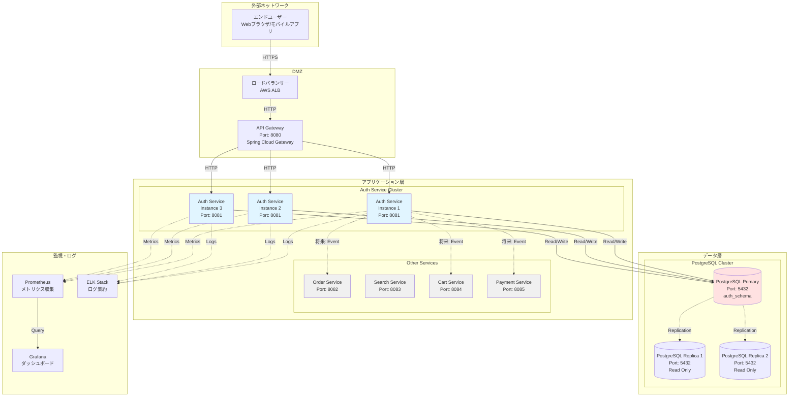

## 3. ネットワーク構成

### 3.1 ネットワークセグメント

| セグメント | CIDR | 用途 | セキュリティグループ |
|-----------|------|------|-------------------|
| Public Subnet | 10.0.1.0/24 | ロードバランサー、API Gateway | インターネットからHTTPS許可 |
| Private Subnet 1 | 10.0.10.0/24 | Auth Service | API Gatewayからのみ許可 |
| Private Subnet 2 | 10.0.20.0/24 | Other Services | API Gatewayからのみ許可 |
| Database Subnet | 10.0.100.0/24 | PostgreSQL | アプリケーション層からのみ許可 |

### 3.2 通信フロー

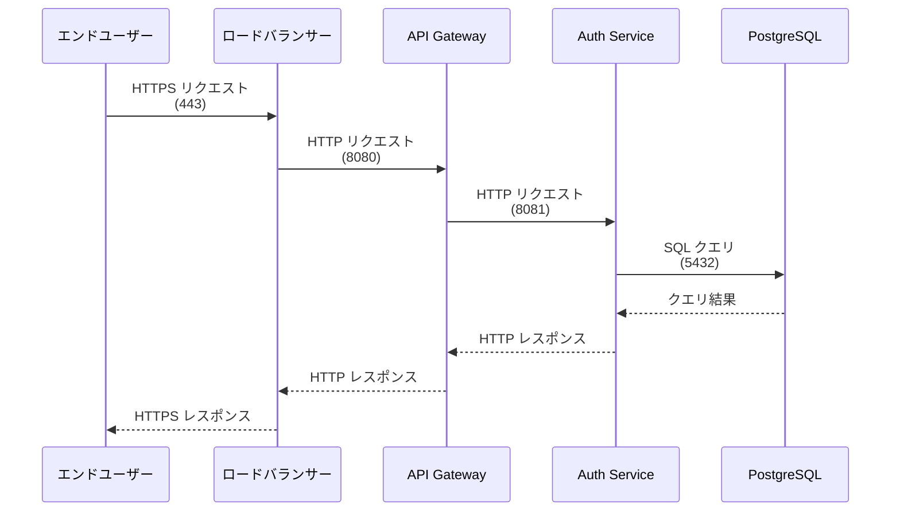

## 4. Auth Serviceの詳細構成

### 4.1 コンポーネント構成

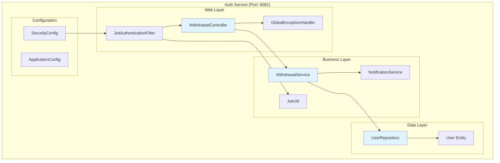

### 4.2 ディレクトリ構造

```
ec-site-auth-service/
├── src/
│   ├── main/
│   │   ├── java/
│   │   │   └── com/ecsite/auth/
│   │   │       ├── config/
│   │   │       │   ├── SecurityConfig.java
│   │   │       │   └── ApplicationConfig.java
│   │   │       ├── controller/
│   │   │       │   ├── AuthController.java
│   │   │       │   └── WithdrawalController.java  ← 新規追加
│   │   │       ├── dto/
│   │   │       │   ├── WithdrawalRequest.java     ← 新規追加
│   │   │       │   └── WithdrawalResponse.java    ← 新規追加
│   │   │       ├── entity/
│   │   │       │   └── User.java                  ← 拡張
│   │   │       ├── exception/
│   │   │       │   └── GlobalExceptionHandler.java
│   │   │       ├── filter/
│   │   │       │   └── JwtAuthenticationFilter.java
│   │   │       ├── repository/
│   │   │       │   └── UserRepository.java
│   │   │       ├── service/
│   │   │       │   ├── AuthService.java
│   │   │       │   ├── NotificationService.java   ← 拡張
│   │   │       │   └── WithdrawalService.java     ← 新規追加
│   │   │       └── util/
│   │   │           └── JwtUtil.java
│   │   └── resources/
│   │       ├── application.yml
│   │       └── db/migration/
│   │           ├── V1__initial_schema.sql
│   │           ├── V2__...sql
│   │           └── V3__add_user_withdrawal_fields.sql  ← 新規追加
│   └── test/
│       └── java/
│           └── com/ecsite/auth/
│               ├── controller/
│               │   └── WithdrawalControllerTest.java   ← 新規追加
│               └── service/
│                   └── WithdrawalServiceTest.java      ← 新規追加
├── build.gradle
├── Dockerfile
└── docker-compose.yml
```

## 5. データベース構成

### 5.1 PostgreSQL構成

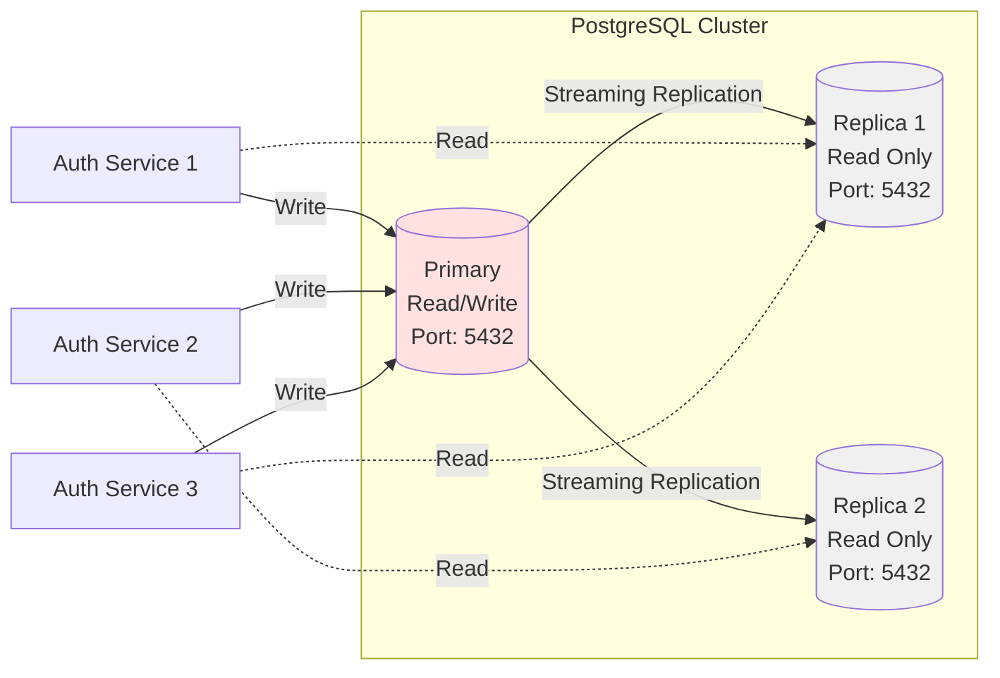

### 5.2 スキーマ構成

| スキーマ | 用途 | テーブル数 | 主要テーブル |
|---------|------|-----------|------------|
| auth_schema | 認証・ユーザー管理 | 3 | users, refresh_tokens, email_verifications |
| public | Flyway管理 | 1 | flyway_schema_history |

### 5.3 接続プール設定

```yaml
# application.yml
spring:
  datasource:
    hikari:
      maximum-pool-size: 10
      minimum-idle: 5
      connection-timeout: 30000
      idle-timeout: 600000
      max-lifetime: 1800000
```

## 6. デプロイ構成

### 6.1 環境構成

| 環境 | 用途 | Auth Service インスタンス数 | DB構成 |
|------|------|---------------------------|--------|
| Development | 開発環境 | 1 | Single Instance |
| Staging | 検証環境 | 2 | Primary + Replica |
| Production | 本番環境 | 3 | Primary + 2 Replicas |

### 6.2 デプロイフロー

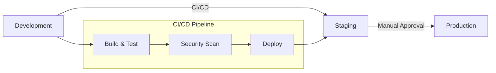

### 6.3 コンテナ構成

**Dockerfile**
```dockerfile
FROM eclipse-temurin:17-jre-alpine
WORKDIR /app
COPY build/libs/auth-service.jar app.jar
EXPOSE 8081
ENTRYPOINT ["java", "-jar", "app.jar"]
```

**docker-compose.yml（開発環境）**
```yaml
version: '3.8'
services:
  auth-service:
    build: .
    ports:
      - "8081:8081"
    environment:
      - SPRING_PROFILES_ACTIVE=dev
      - DB_HOST=postgres
      - DB_PORT=5432
      - DB_NAME=auth_db
      - JWT_SECRET=${JWT_SECRET}
    depends_on:
      - postgres
  
  postgres:
    image: postgres:15-alpine
    ports:
      - "5432:5432"
    environment:
      - POSTGRES_DB=auth_db
      - POSTGRES_USER=auth_user
      - POSTGRES_PASSWORD=${DB_PASSWORD}
    volumes:
      - postgres_data:/var/lib/postgresql/data

volumes:
  postgres_data:
```

## 7. セキュリティ構成

### 7.1 ファイアウォールルール

| ソース | ターゲット | ポート | プロトコル | 用途 |
|--------|----------|--------|----------|------|
| Internet | ロードバランサー | 443 | HTTPS | ユーザーアクセス |
| ロードバランサー | API Gateway | 8080 | HTTP | 内部通信 |
| API Gateway | Auth Service | 8081 | HTTP | 内部通信 |
| Auth Service | PostgreSQL | 5432 | TCP | データベースアクセス |
| 監視サーバー | Auth Service | 9090 | HTTP | メトリクス収集 |

### 7.2 認証・認可フロー

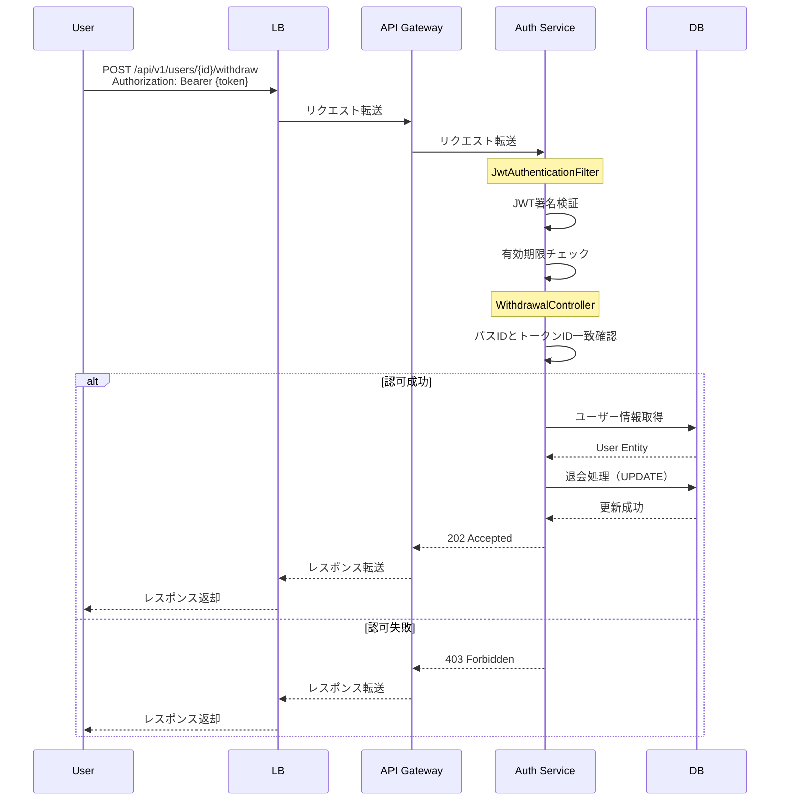

## 8. 監視・ログ構成

### 8.1 メトリクス収集

| メトリクス | 収集方法 | 保存先 | 可視化 |
|-----------|---------|--------|--------|
| HTTPリクエスト数 | Spring Actuator | Prometheus | Grafana |
| レスポンスタイム | Spring Actuator | Prometheus | Grafana |
| エラー率 | Spring Actuator | Prometheus | Grafana |
| JVMメモリ使用量 | Spring Actuator | Prometheus | Grafana |
| データベース接続数 | HikariCP | Prometheus | Grafana |

### 8.2 ログ構成

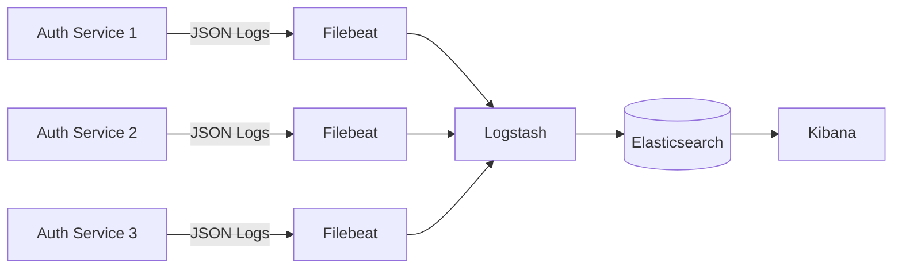

### 8.3 アラート設定

| アラート | 条件 | 通知先 | 重要度 |
|---------|------|--------|--------|
| サービスダウン | ヘルスチェック失敗 | Slack, Email | Critical |
| エラー率上昇 | エラー率 > 5% | Slack | High |
| レスポンス遅延 | P95 > 1秒 | Slack | Medium |
| データベース接続エラー | 接続失敗 | Slack, Email | Critical |

## 9. バックアップ・リカバリ構成

### 9.1 バックアップ戦略

| 対象 | 方式 | 頻度 | 保持期間 |
|------|------|------|---------|
| PostgreSQL | pg_dump | 毎日深夜 | 30日間 |
| PostgreSQL WAL | 継続的アーカイブ | リアルタイム | 7日間 |
| アプリケーションログ | S3アーカイブ | 毎日 | 90日間 |
| 設定ファイル | Git管理 | コミット時 | 無期限 |

### 9.2 リカバリ手順

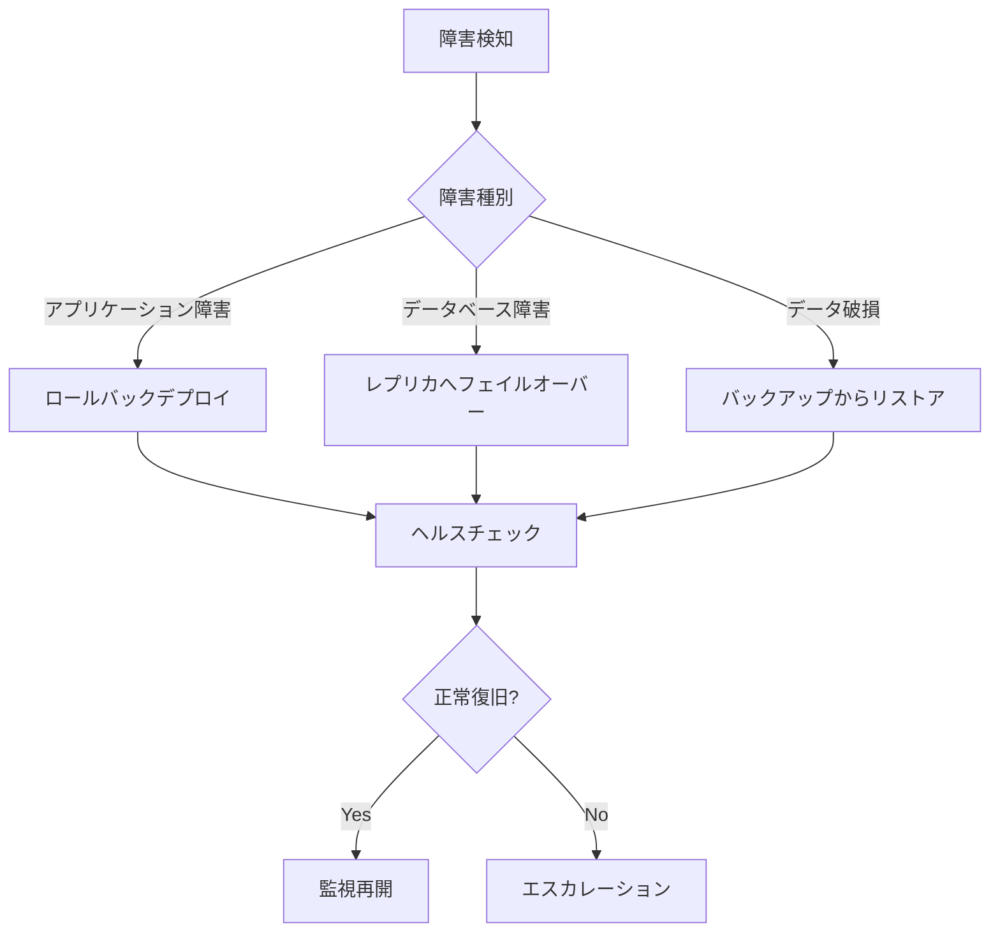

## 10. スケーリング戦略

### 10.1 水平スケーリング

**オートスケーリング条件**
- CPU使用率 > 70% → スケールアウト
- CPU使用率 < 30% → スケールイン
- 最小インスタンス数: 2
- 最大インスタンス数: 10

### 10.2 垂直スケーリング

| 環境 | CPU | メモリ | 想定負荷 |
|------|-----|--------|---------|
| Development | 1 vCPU | 2GB | 開発用 |
| Staging | 2 vCPU | 4GB | 検証用 |
| Production | 4 vCPU | 8GB | 本番用 |

## 11. 将来の拡張計画

### 11.1 Phase 2: キャッシュ層の追加

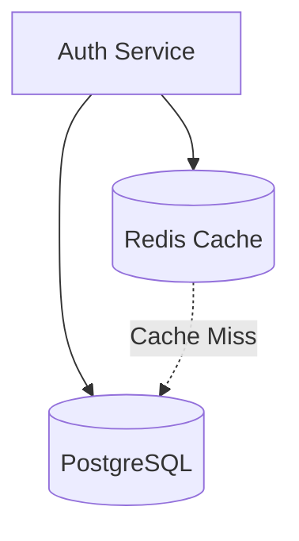

### 11.2 Phase 3: イベント駆動アーキテクチャ

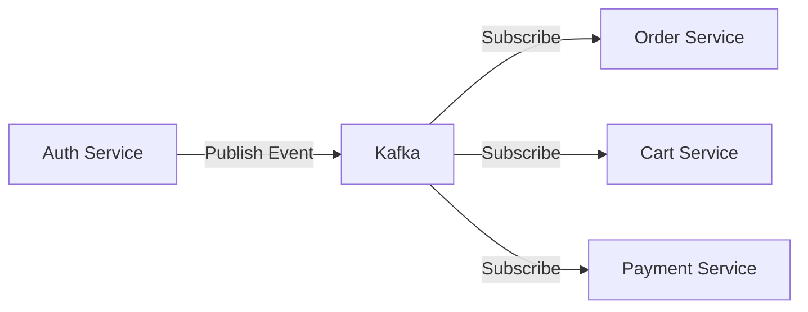

### 11.3 Phase 4: CDN導入

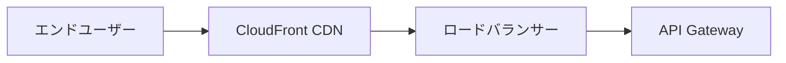

## 12. 関連ドキュメント

- [API仕様書](./API仕様書.md)
- [データベース設計書](./データベース設計書.md)
- [アーキテクチャ設計書](./アーキテクチャ設計書.md)
- [セキュリティ設計書](./セキュリティ設計書.md)

## 13. 変更履歴

| 日付 | バージョン | 変更内容 | 担当者 |
|------|-----------|---------|--------|
| 2025-11-11 | 1.0.0 | 初版作成 | Devin |

---

**作成者**: Devin  
**承認者**: （レビュー待ち）  
**最終更新**: 2025-11-11
