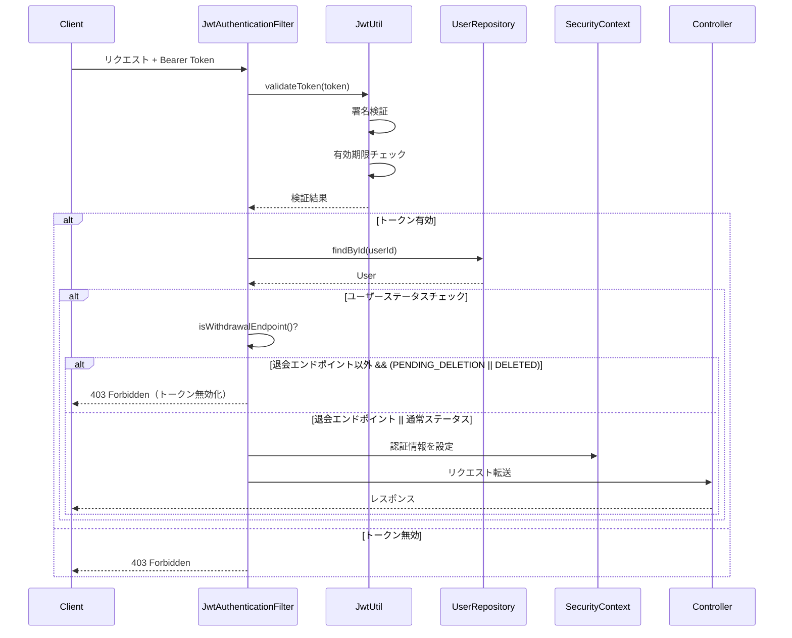
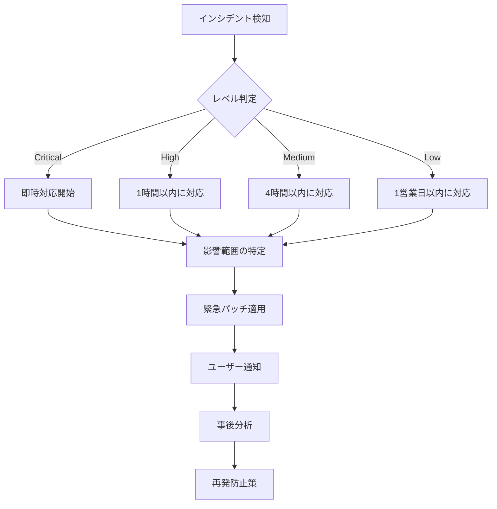

# セキュリティ設計書 - ユーザー退会処理機能

## ドキュメント情報
- **プロジェクト**: EC-Site認証サービス
- **チケット**: EC-19
- **作成日**: 2025-11-11
- **バージョン**: 1.0.0
- **ステータス**: 実装完了

## 1. 概要

### 1.1 目的
ユーザー退会処理機能におけるセキュリティリスクを特定し、適切な対策を実装する。

### 1.2 セキュリティ目標
- **機密性**: 個人情報の不正アクセス防止
- **完全性**: データの改ざん防止
- **可用性**: サービスの継続的な提供
- **認証**: 正当なユーザーの識別
- **認可**: 適切な権限管理
- **監査**: 操作履歴の記録

## 2. 脅威モデル

### 2.1 STRIDE分析

| 脅威カテゴリ | 脅威シナリオ | リスクレベル | 対策 |
|------------|------------|------------|------|
| **Spoofing（なりすまし）** | 他人のトークンを使用して不正退会 | 高 | JWT署名検証、トークン有効期限 |
| **Tampering（改ざん）** | リクエストパラメータの改ざん | 中 | HTTPS/TLS、入力バリデーション |
| **Repudiation（否認）** | 退会操作の否認 | 中 | 監査ログ、タイムスタンプ |
| **Information Disclosure（情報漏洩）** | 他人の退会状態の閲覧 | 高 | 認可チェック、エラーメッセージの制限 |
| **Denial of Service（サービス拒否）** | 大量の退会リクエスト | 中 | レート制限、タイムアウト設定 |
| **Elevation of Privilege（権限昇格）** | 管理者権限の不正取得 | 高 | ロールベースアクセス制御 |

### 2.2 攻撃シナリオと対策

#### シナリオ1: 他人のアカウントを退会させる攻撃
**攻撃手法**:
```bash
# 攻撃者が自分のトークンで他人のIDを指定
curl -X POST https://api.example.com/api/v1/users/victim-user-id/withdraw \
  -H "Authorization: Bearer attacker-token"
```

**対策**:
- パスパラメータのユーザーIDとJWTトークンのユーザーIDの一致を必須チェック
- 不一致の場合は403 Forbiddenを返却
- エラーメッセージで詳細情報を漏らさない

**実装**:
```java
@PostMapping("/{id}/withdraw")
public ResponseEntity<WithdrawalResponse> withdrawUser(
    @PathVariable UUID id,
    @Valid @RequestBody WithdrawalRequest request,
    @AuthenticationPrincipal UserDetails userDetails) {
    
    // 認可チェック: 自己退会のみ許可
    UUID authenticatedUserId = UUID.fromString(userDetails.getUsername());
    if (!id.equals(authenticatedUserId)) {
        throw new ForbiddenException("自分自身のアカウントのみ退会できます");
    }
    
    // 退会処理実行
    WithdrawalResponse response = withdrawalService.withdrawUser(id, request);
    return ResponseEntity.status(HttpStatus.ACCEPTED).body(response);
}
```

#### シナリオ2: トークン盗聴による不正アクセス
**攻撃手法**:
- 中間者攻撃（MITM）によるトークン盗聴
- XSS攻撃によるトークン窃取

**対策**:
- HTTPS/TLS 1.3の強制
- HTTP Strict Transport Security (HSTS) ヘッダー
- トークンの短い有効期限（15分）
- HttpOnly Cookie（将来対応）

#### シナリオ3: CSRF攻撃
**攻撃手法**:
```html
<!-- 悪意のあるサイトに埋め込まれたフォーム -->
<form action="https://api.example.com/api/v1/users/victim-id/withdraw" method="POST">
  <input type="hidden" name="reason" value="攻撃">
</form>
<script>document.forms[0].submit();</script>
```

**対策**:
- JWT Bearer Token認証を使用（ステートレス）
- APIエンドポイントに対してCSRF保護を無効化
- SameSite Cookie属性（将来対応）

**実装**:
```java
@Bean
public SecurityFilterChain filterChain(HttpSecurity http) throws Exception {
    http
        .csrf(csrf -> csrf
            .ignoringRequestMatchers("/api/**")  // APIはCSRF保護不要
        )
        .authorizeHttpRequests(auth -> auth
            .requestMatchers("/api/v1/auth/**").permitAll()
            .anyRequest().authenticated()
        );
    return http.build();
}
```

#### シナリオ4: SQLインジェクション
**攻撃手法**:
```bash
# 退会理由にSQLを注入
curl -X POST https://api.example.com/api/v1/users/{id}/withdraw \
  -d '{"reason": "'; DROP TABLE users; --"}'
```

**対策**:
- JPA/Hibernateのパラメータバインディング使用
- 生SQLの禁止
- 入力バリデーション

**実装**:
```java
// JPA Repository（安全）
@Repository
public interface UserRepository extends JpaRepository<User, UUID> {
    // パラメータバインディングで自動的にエスケープ
    Optional<User> findById(UUID id);
}
```

## 3. 認証・認可設計

### 3.1 認証方式

#### 3.1.1 JWT Bearer Token認証
**仕様**:
- **アルゴリズム**: HS256（HMAC with SHA-256）
- **有効期限**: アクセストークン15分、リフレッシュトークン7日間
- **ペイロード**:
  ```json
  {
    "sub": "user-id",
    "email": "user@example.com",
    "roles": ["USER"],
    "iat": 1699699200,
    "exp": 1699700100
  }
  ```

**セキュリティ考慮事項**:
- 秘密鍵は環境変数で管理（`JWT_SECRET`）
- 秘密鍵は256ビット以上のランダム文字列
- トークンはHTTPSでのみ送信

#### 3.1.2 トークン検証フロー


#### 3.1.3 トークン無効化ロジック（ハイブリッドアプローチ）

**設計方針**:
退会処理中（PENDING_DELETION）または退会済み（DELETED）ユーザーのトークンを無効化しつつ、退会エンドポイントの冪等性を維持する。

**実装方式（Option C: ハイブリッドアプローチ）**:
1. **退会エンドポイント以外**: JwtAuthenticationFilterでPENDING_DELETION/DELETEDユーザーのトークンを拒否（403 Forbidden）
2. **退会エンドポイント**: フィルターを通過させ、コントローラーで409 Conflictを返して冪等性を維持

**実装コード**:
```java
@Component
@RequiredArgsConstructor
@Slf4j
public class JwtAuthenticationFilter extends OncePerRequestFilter {
    private final JwtUtil jwtUtil;
    private final UserRepository userRepository;

    @Override
    protected void doFilterInternal(
        HttpServletRequest request,
        HttpServletResponse response,
        FilterChain filterChain) throws ServletException, IOException {
        
        String token = extractToken(request);
        if (token != null && jwtUtil.validateToken(token)) {
            String userId = jwtUtil.getUserIdFromToken(token);
            String role = jwtUtil.getRoleFromToken(token);
            
            if (userId != null && SecurityContextHolder.getContext().getAuthentication() == null) {
                boolean isWithdrawalEndpoint = isWithdrawalEndpoint(request);
                
                User user = userRepository.findById(UUID.fromString(userId)).orElse(null);
                if (user == null) {
                    // 退会エンドポイントの場合は認証を設定（コントローラーで404を返すため）
                    if (isWithdrawalEndpoint) {
                        setAuthentication(userId, role, request);
                    }
                } else {
                    // 退会エンドポイント以外でPENDING_DELETION/DELETEDの場合は拒否
                    if (!isWithdrawalEndpoint && 
                        (user.getStatus() == User.UserStatus.PENDING_DELETION || 
                         user.getStatus() == User.UserStatus.DELETED)) {
                        log.warn("JWT authentication rejected: User is {} (userId: {})", 
                                 user.getStatus(), userId);
                        filterChain.doFilter(request, response);
                        return;
                    }
                    
                    setAuthentication(userId, role, request);
                }
            }
        }
        
        filterChain.doFilter(request, response);
    }
    
    private boolean isWithdrawalEndpoint(HttpServletRequest request) {
        String path = request.getRequestURI();
        String method = request.getMethod();
        return "POST".equals(method) && 
               (path.matches(".*/api/v1/users/[^/]+/withdraw") || 
                path.matches(".*/api/v1/users/me/withdraw"));
    }
}
```

**セキュリティ上の利点**:
- 退会後のトークンで保護されたエンドポイントにアクセスできない
- 退会エンドポイントの冪等性を維持（同じリクエストを複数回実行しても409 Conflictを返す）
- 非存在ユーザーの場合も適切にハンドリング（退会エンドポイントでは404、他では403）

### 3.2 認可設計

#### 3.2.1 権限マトリクス

| エンドポイント | 認証 | 認可ルール | 許可ロール |
|--------------|------|-----------|----------|
| POST /api/v1/users/{id}/withdraw | 必須 | 自己IDのみ | USER |
| POST /api/v1/admin/users/{id}/withdraw | 必須 | 任意のID | ADMIN（将来実装） |
| POST /api/v1/users/me/withdraw | 必須 | 自己のみ | USER（将来実装） |

#### 3.2.2 認可チェックの実装

**方式1: コントローラーレベルでの明示的チェック（現在の実装）**
```java
@PostMapping("/{id}/withdraw")
public ResponseEntity<WithdrawalResponse> withdrawUser(
    @PathVariable UUID id,
    @Valid @RequestBody WithdrawalRequest request,
    @AuthenticationPrincipal UserDetails userDetails) {
    
    UUID authenticatedUserId = UUID.fromString(userDetails.getUsername());
    if (!id.equals(authenticatedUserId)) {
        throw new ForbiddenException("自分自身のアカウントのみ退会できます");
    }
    
    // 処理続行
}
```

**方式2: メソッドセキュリティ（将来対応）**
```java
@PreAuthorize("#id == authentication.principal.username")
@PostMapping("/{id}/withdraw")
public ResponseEntity<WithdrawalResponse> withdrawUser(
    @PathVariable UUID id,
    @Valid @RequestBody WithdrawalRequest request) {
    // 処理続行
}
```

## 4. データ保護

### 4.1 個人情報の保護

#### 4.1.1 保存時の保護
| データ項目 | 保護方式 | 理由 |
|-----------|---------|------|
| パスワード | BCrypt（コスト12） | 不可逆ハッシュ |
| メールアドレス | 平文 | 検索・通知に必要 |
| 退会理由 | 平文 | 分析に必要 |
| 削除予定日時 | 平文 | バッチ処理に必要 |

#### 4.1.2 最終削除時の匿名化
```java
// 猶予期間終了後の匿名化処理（将来実装）
public void anonymizeUser(User user) {
    user.setEmail("deleted_" + user.getId() + "@deleted.local");
    user.setFirstName("削除済み");
    user.setLastName("ユーザー");
    user.setPasswordHash("DELETED");
    user.setWithdrawalReason(null);
    user.setStatus(UserStatus.DELETED);
    user.setDeletedAt(LocalDateTime.now(ZoneOffset.UTC));
    userRepository.save(user);
}
```

### 4.2 通信の保護

#### 4.2.1 HTTPS/TLS設定
- **プロトコル**: TLS 1.3（TLS 1.2も許可）
- **暗号スイート**: 
  - TLS_AES_256_GCM_SHA384
  - TLS_AES_128_GCM_SHA256
- **証明書**: Let's Encrypt（自動更新）

#### 4.2.2 セキュリティヘッダー
```yaml
# application.yml
server:
  ssl:
    enabled: true
    protocol: TLS
    enabled-protocols: TLSv1.3,TLSv1.2
  
spring:
  security:
    headers:
      hsts: max-age=31536000; includeSubDomains
      content-security-policy: default-src 'self'
      x-content-type-options: nosniff
      x-frame-options: DENY
      x-xss-protection: 1; mode=block
```

## 5. 入力バリデーション

### 5.1 バリデーションルール

| フィールド | ルール | エラーメッセージ |
|-----------|--------|----------------|
| id（パスパラメータ） | UUID形式 | "無効なユーザーIDです" |
| reason | 最大1000文字 | "退会理由は1000文字以内で入力してください" |
| reason | 任意 | - |

### 5.2 実装

**DTOレベルのバリデーション**
```java
public class WithdrawalRequest {
    @Size(max = 1000, message = "退会理由は1000文字以内で入力してください")
    private String reason;
}
```

**コントローラーレベルのバリデーション**
```java
@PostMapping("/{id}/withdraw")
public ResponseEntity<WithdrawalResponse> withdrawUser(
    @PathVariable UUID id,  // Spring MVCが自動的にUUID検証
    @Valid @RequestBody WithdrawalRequest request) {
    // 処理続行
}
```

## 6. 監査ログ

### 6.1 ログ記録項目

| 項目 | 内容 | 目的 |
|------|------|------|
| タイムスタンプ | ISO 8601形式（UTC） | 操作時刻の記録 |
| ユーザーID | UUID | 操作者の特定 |
| 操作内容 | "USER_WITHDRAWAL_REQUESTED" | 操作種別 |
| IPアドレス | クライアントIP | アクセス元の追跡 |
| User-Agent | ブラウザ情報 | デバイスの特定 |
| 退会理由 | ユーザー入力 | 分析用 |
| 結果 | SUCCESS/FAILURE | 操作結果 |

### 6.2 ログ実装

**アプリケーションログ**
```java
@Slf4j
@Service
public class WithdrawalService {
    public WithdrawalResponse withdrawUser(UUID userId, WithdrawalRequest request) {
        log.info("User withdrawal requested: userId={}, reason={}", 
                 userId, request.getReason());
        
        try {
            // 退会処理
            log.info("User withdrawal completed: userId={}, scheduledDeletionAt={}", 
                     userId, user.getDeletionScheduledAt());
            return response;
        } catch (Exception e) {
            log.error("User withdrawal failed: userId={}, error={}", 
                      userId, e.getMessage(), e);
            throw e;
        }
    }
}
```

**将来の監査テーブル（Phase 5）**
```sql
CREATE TABLE auth_schema.audit_log (
    id UUID PRIMARY KEY,
    timestamp TIMESTAMP NOT NULL,
    user_id UUID NOT NULL,
    action VARCHAR(100) NOT NULL,
    ip_address VARCHAR(45),
    user_agent TEXT,
    request_data JSONB,
    result VARCHAR(20) NOT NULL,
    error_message TEXT,
    created_at TIMESTAMP NOT NULL DEFAULT CURRENT_TIMESTAMP
);

CREATE INDEX idx_audit_log_user_id ON auth_schema.audit_log(user_id);
CREATE INDEX idx_audit_log_timestamp ON auth_schema.audit_log(timestamp);
CREATE INDEX idx_audit_log_action ON auth_schema.audit_log(action);
```

## 7. エラーハンドリング

### 7.1 セキュアなエラーメッセージ

**原則**: 攻撃者に有用な情報を与えない

| シナリオ | 内部エラー | ユーザー向けメッセージ |
|---------|-----------|---------------------|
| ユーザーが存在しない | "User not found: {id}" | "ユーザーが見つかりません" |
| 認証失敗 | "Invalid JWT signature" | "認証が必要です" |
| 認可失敗 | "User {id1} cannot withdraw user {id2}" | "自分自身のアカウントのみ退会できます" |
| システムエラー | "NullPointerException at line 123" | "サーバーエラーが発生しました" |

### 7.2 実装

```java
@RestControllerAdvice
public class GlobalExceptionHandler {
    
    @ExceptionHandler(ForbiddenException.class)
    public ResponseEntity<ErrorResponse> handleForbidden(ForbiddenException e) {
        log.warn("Forbidden access attempt: {}", e.getMessage());
        return ResponseEntity.status(HttpStatus.FORBIDDEN)
            .body(new ErrorResponse("error", "自分自身のアカウントのみ退会できます"));
    }
    
    @ExceptionHandler(Exception.class)
    public ResponseEntity<ErrorResponse> handleGeneral(Exception e) {
        log.error("Unexpected error", e);  // 詳細はログのみ
        return ResponseEntity.status(HttpStatus.INTERNAL_SERVER_ERROR)
            .body(new ErrorResponse("error", "サーバーエラーが発生しました"));
    }
}
```

## 8. レート制限

### 8.1 レート制限ポリシー

| エンドポイント | 制限 | 期間 | 超過時の動作 |
|--------------|------|------|------------|
| POST /api/v1/users/{id}/withdraw | 5回 | 1時間 | 429 Too Many Requests |
| POST /api/v1/auth/login | 10回 | 15分 | 429 Too Many Requests |

### 8.2 実装（将来対応）

**Spring Boot Bucket4j**
```java
@Configuration
public class RateLimitConfig {
    
    @Bean
    public Bucket withdrawalBucket() {
        Bandwidth limit = Bandwidth.classic(5, Refill.intervally(5, Duration.ofHours(1)));
        return Bucket.builder()
            .addLimit(limit)
            .build();
    }
}
```

## 9. セキュリティテスト

### 9.1 テスト観点

| カテゴリ | テスト項目 | 期待結果 |
|---------|-----------|---------|
| 認証 | トークンなしでアクセス | 401 Unauthorized |
| 認証 | 無効なトークンでアクセス | 401 Unauthorized |
| 認証 | 期限切れトークンでアクセス | 401 Unauthorized |
| 認可 | 他人のIDを指定 | 403 Forbidden |
| 認可 | 自己IDを指定 | 202 Accepted |
| 入力検証 | 退会理由1001文字 | 400 Bad Request |
| 入力検証 | 無効なUUID | 404 Not Found |
| SQLインジェクション | SQLを含む退会理由 | 正常処理（エスケープ） |
| XSS | スクリプトを含む退会理由 | 正常処理（エスケープ） |

### 9.2 セキュリティスキャン

**OWASP Dependency Check（将来対応）**
```gradle
plugins {
    id 'org.owasp.dependencycheck' version '8.4.0'
}

dependencyCheck {
    format = 'ALL'
    failBuildOnCVSS = 7
}
```

**SonarQube（既存）**
- セキュリティホットスポットの検出
- 脆弱性の自動スキャン
- コード品質の継続的監視

## 10. コンプライアンス

### 10.1 GDPR対応

| 要件 | 実装状況 | 備考 |
|------|---------|------|
| 削除権（Right to Erasure） | ✅ 実装済み | 退会処理機能 |
| データポータビリティ | ❌ 未実装 | 将来対応 |
| 同意の撤回 | ✅ 実装済み | 退会処理機能 |
| 処理の透明性 | ✅ 実装済み | API仕様書、プライバシーポリシー |
| データ保護影響評価 | ⚠️ 部分実装 | 本ドキュメント |

### 10.2 個人情報保護法対応

| 要件 | 実装状況 | 備考 |
|------|---------|------|
| 利用目的の明示 | ✅ 実装済み | プライバシーポリシー |
| 安全管理措置 | ✅ 実装済み | 暗号化、アクセス制御 |
| 第三者提供の制限 | ✅ 実装済み | データ共有なし |
| 開示請求への対応 | ❌ 未実装 | 将来対応 |

## 11. インシデント対応

### 11.1 セキュリティインシデントの分類

| レベル | 定義 | 対応時間 | 対応者 |
|--------|------|---------|--------|
| Critical | データ漏洩、システム侵害 | 即時 | セキュリティチーム |
| High | 認証バイパス、権限昇格 | 1時間以内 | 開発チーム |
| Medium | DoS攻撃、異常アクセス | 4時間以内 | 運用チーム |
| Low | 軽微な脆弱性 | 1営業日以内 | 開発チーム |

### 11.2 インシデント対応フロー



## 12. セキュリティチェックリスト

### 12.1 実装時チェックリスト

- [x] JWT署名検証の実装
- [x] トークン有効期限のチェック
- [x] 認可チェック（自己IDのみ）
- [x] 入力バリデーション
- [x] HTTPS/TLS設定
- [x] CSRF保護の適切な設定
- [x] SQLインジェクション対策（JPA使用）
- [x] エラーメッセージの適切な制御
- [x] 監査ログの記録
- [ ] レート制限（将来対応）
- [ ] セキュリティヘッダー（将来対応）
- [ ] OWASP Dependency Check（将来対応）

### 12.2 デプロイ前チェックリスト

- [ ] セキュリティテストの実施
- [ ] 脆弱性スキャンの実施
- [ ] ペネトレーションテストの実施
- [ ] セキュリティレビューの完了
- [ ] インシデント対応手順の確認
- [ ] バックアップ・リストア手順の確認

## 13. 既知のセキュリティ制約

### 13.1 トークン無効化の遅延
- **制約**: 退会後も既存JWTトークンは有効期限まで使用可能
- **リスク**: 退会後15分間はAPIアクセスが可能
- **リスクレベル**: Medium
- **緩和策**: アクセストークンの有効期限を短く設定（15分）
- **将来対応**: トークンバージョン管理またはブラックリスト方式

### 13.2 メール送信の未実装
- **制約**: 退会確認メールが送信されない
- **リスク**: ユーザーが退会処理を認識できない
- **リスクレベル**: Low
- **緩和策**: ログ出力で記録
- **将来対応**: SMTP/SendGrid統合

### 13.3 レート制限の未実装
- **制約**: DoS攻撃への対策が不十分
- **リスク**: 大量の退会リクエストによるサービス停止
- **リスクレベル**: Medium
- **緩和策**: API Gatewayレベルでのレート制限
- **将来対応**: Bucket4j導入

## 14. 関連ドキュメント

- [API仕様書](./API仕様書.md)
- [データベース設計書](./データベース設計書.md)
- [アーキテクチャ設計書](./アーキテクチャ設計書.md)
- [システム構成図](./システム構成図.md)

## 15. 変更履歴

| 日付 | バージョン | 変更内容 | 担当者 |
|------|-----------|---------|--------|
| 2025-11-11 | 1.0.0 | 初版作成 | Devin |

---

**作成者**: Devin  
**承認者**: （レビュー待ち）  
**最終更新**: 2025-11-11
