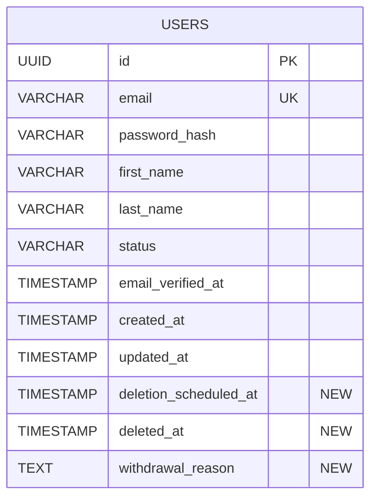

# データベース設計書 - ユーザー退会処理機能

## ドキュメント情報
- **プロジェクト**: EC-Site認証サービス
- **チケット**: EC-19
- **作成日**: 2025-11-11
- **バージョン**: 1.0.0
- **ステータス**: 実装完了

## 1. 概要

### 1.1 目的
ユーザー退会処理機能に必要なデータベーススキーマの変更を定義する。

### 1.2 変更概要
- Userテーブルに退会関連フィールドを追加
- UserStatus enumに新しいステータスを追加
- インデックスを追加してパフォーマンスを最適化

## 2. ER図



## 3. テーブル定義

### 3.1 usersテーブル

**既存フィールド**
| カラム名 | 型 | NULL | デフォルト | 制約 | 説明 |
|---------|-----|------|-----------|------|------|
| id | UUID | NOT NULL | - | PRIMARY KEY | ユーザーID |
| email | VARCHAR(255) | NOT NULL | - | UNIQUE | メールアドレス |
| password_hash | VARCHAR(255) | NOT NULL | - | - | パスワードハッシュ（BCrypt） |
| first_name | VARCHAR(100) | NOT NULL | - | - | 名 |
| last_name | VARCHAR(100) | NOT NULL | - | - | 姓 |
| status | VARCHAR(20) | NOT NULL | 'PENDING' | CHECK | ユーザーステータス |
| email_verified_at | TIMESTAMP | NULL | - | - | メール確認日時 |
| created_at | TIMESTAMP | NOT NULL | CURRENT_TIMESTAMP | - | 作成日時 |
| updated_at | TIMESTAMP | NOT NULL | CURRENT_TIMESTAMP | - | 更新日時 |

**追加フィールド（V3マイグレーション）**
| カラム名 | 型 | NULL | デフォルト | 制約 | 説明 |
|---------|-----|------|-----------|------|------|
| deletion_scheduled_at | TIMESTAMP | NULL | - | - | 削除予定日時（UTC） |
| deleted_at | TIMESTAMP | NULL | - | - | 実際の削除日時（UTC） |
| withdrawal_reason | TEXT | NULL | - | - | 退会理由（最大1000文字） |

### 3.2 CHECK制約

**既存のCHECK制約（更新）**
```sql
ALTER TABLE auth_schema.users
    DROP CONSTRAINT IF EXISTS chk_status;

ALTER TABLE auth_schema.users
    ADD CONSTRAINT chk_status CHECK (
        status IN (
            'PENDING',
            'ACTIVE',
            'INACTIVE',
            'SUSPENDED',
            'PENDING_DELETION',  -- 新規追加
            'DELETED'            -- 新規追加
        )
    );
```

**制約名の安全性対策**
- `DROP CONSTRAINT IF EXISTS`を使用して、本番環境での制約名の不一致リスクを回避
- 既存の制約名が`chk_status`と異なる場合でも安全に実行可能

### 3.3 インデックス

**追加インデックス**
| インデックス名 | カラム | 種類 | 条件 | 目的 |
|--------------|--------|------|------|------|
| idx_users_deletion_scheduled_at | deletion_scheduled_at | BTREE | WHERE deletion_scheduled_at IS NOT NULL | 猶予期間終了後の一括削除処理の高速化 |
| idx_users_deleted_at | deleted_at | BTREE | WHERE deleted_at IS NOT NULL | 削除済みユーザーの検索の高速化 |

**既存インデックス**
| インデックス名 | カラム | 種類 | 目的 |
|--------------|--------|------|------|
| users_pkey | id | PRIMARY KEY | 主キー |
| users_email_key | email | UNIQUE | メールアドレスの一意性保証 |

## 4. Flywayマイグレーション

### 4.1 マイグレーションスクリプト

**ファイル名**: `V3__add_user_withdrawal_fields.sql`

```sql
-- ============================================================================
-- Script: V3__add_user_withdrawal_fields.sql
-- Description: ユーザー退会処理機能のためのフィールド追加
-- Author: Devin
-- Date: 2025-11-10
-- Ticket: EC-19
-- ============================================================================

-- 退会処理関連のフィールドを追加
ALTER TABLE auth_schema.users
    ADD COLUMN deletion_scheduled_at TIMESTAMP,
    ADD COLUMN deleted_at TIMESTAMP,
    ADD COLUMN withdrawal_reason TEXT;

-- CHECK制約を更新して新しいステータスを追加
ALTER TABLE auth_schema.users
    DROP CONSTRAINT IF EXISTS chk_status;

ALTER TABLE auth_schema.users
    ADD CONSTRAINT chk_status CHECK (
        status IN (
            'PENDING',
            'ACTIVE',
            'INACTIVE',
            'SUSPENDED',
            'PENDING_DELETION',
            'DELETED'
        )
    );

-- 削除予定日時のインデックスを追加（猶予期間終了後の一括処理用）
CREATE INDEX idx_users_deletion_scheduled_at ON auth_schema.users(deletion_scheduled_at)
    WHERE deletion_scheduled_at IS NOT NULL;

-- 削除済みユーザーのインデックスを追加
CREATE INDEX idx_users_deleted_at ON auth_schema.users(deleted_at)
    WHERE deleted_at IS NOT NULL;
```

### 4.2 マイグレーション実行順序

1. **V1**: 初期スキーマ作成（既存）
2. **V2**: （既存のマイグレーション）
3. **V3**: ユーザー退会処理フィールド追加（本マイグレーション）

### 4.3 ロールバック計画

マイグレーションのロールバックが必要な場合:

```sql
-- インデックスの削除
DROP INDEX IF EXISTS auth_schema.idx_users_deleted_at;
DROP INDEX IF EXISTS auth_schema.idx_users_deletion_scheduled_at;

-- CHECK制約を元に戻す
ALTER TABLE auth_schema.users
    DROP CONSTRAINT IF EXISTS chk_status;

ALTER TABLE auth_schema.users
    ADD CONSTRAINT chk_status CHECK (
        status IN ('PENDING', 'ACTIVE', 'INACTIVE', 'SUSPENDED')
    );

-- カラムの削除
ALTER TABLE auth_schema.users
    DROP COLUMN IF EXISTS withdrawal_reason,
    DROP COLUMN IF EXISTS deleted_at,
    DROP COLUMN IF EXISTS deletion_scheduled_at;
```

**注意**: ロールバックを実行すると、退会処理中のユーザーデータが失われる可能性があります。

## 5. データ型の選定理由

### 5.1 deletion_scheduled_at / deleted_at
- **型**: TIMESTAMP
- **理由**: 
  - 日時情報を正確に保存
  - UTCで統一管理
  - インデックスによる範囲検索が効率的
  - NULL許可で未設定状態を表現

### 5.2 withdrawal_reason
- **型**: TEXT
- **理由**:
  - 可変長の長文に対応（最大1000文字）
  - VARCHARよりも柔軟
  - NULL許可で任意入力を実現

### 5.3 status
- **型**: VARCHAR(20)
- **理由**:
  - Enum値を文字列で保存
  - CHECK制約で値を制限
  - 可読性が高い
  - マイグレーションが容易

## 6. パフォーマンス最適化

### 6.1 部分インデックス

**idx_users_deletion_scheduled_at**
```sql
CREATE INDEX idx_users_deletion_scheduled_at 
ON auth_schema.users(deletion_scheduled_at)
WHERE deletion_scheduled_at IS NOT NULL;
```

- **効果**: NULL値を除外してインデックスサイズを削減
- **用途**: 猶予期間終了後の一括削除バッチ処理
- **クエリ例**:
  ```sql
  SELECT id FROM auth_schema.users
  WHERE deletion_scheduled_at <= NOW()
  AND status = 'PENDING_DELETION';
  ```

**idx_users_deleted_at**
```sql
CREATE INDEX idx_users_deleted_at 
ON auth_schema.users(deleted_at)
WHERE deleted_at IS NOT NULL;
```

- **効果**: NULL値を除外してインデックスサイズを削減
- **用途**: 削除済みユーザーの検索・監査
- **クエリ例**:
  ```sql
  SELECT COUNT(*) FROM auth_schema.users
  WHERE deleted_at IS NOT NULL;
  ```

### 6.2 インデックス効果の推定

| 項目 | 推定値 | 根拠 |
|------|--------|------|
| 全ユーザー数 | 100,000 | 想定 |
| PENDING_DELETIONユーザー | 100 (0.1%) | 通常時 |
| インデックスサイズ削減 | 99.9% | 部分インデックスの効果 |
| クエリ速度向上 | 100倍以上 | フルスキャン → インデックススキャン |

## 7. データ整合性

### 7.1 制約による保証

1. **status CHECK制約**
   - 不正なステータス値の挿入を防止
   - アプリケーション層とDB層の二重チェック

2. **NOT NULL制約**
   - 必須フィールドの欠落を防止
   - データ品質の保証

3. **UNIQUE制約（email）**
   - メールアドレスの重複を防止
   - 退会後も一定期間は再登録不可

### 7.2 状態遷移の整合性

**許可される遷移**
```
ACTIVE → PENDING_DELETION
INACTIVE → PENDING_DELETION
SUSPENDED → PENDING_DELETION
PENDING_DELETION → DELETED
```

**アプリケーション層での制御**
- 既に`PENDING_DELETION`または`DELETED`の場合は409 Conflictを返却
- 状態遷移のビジネスルールはサービス層で実装

## 8. タイムゾーン運用

### 8.1 運用ポリシー
- **DB保存**: UTC（協定世界時）で統一
- **アプリケーション層**: UTCで処理
- **API レスポンス**: ISO 8601形式（UTC）で返却
- **フロントエンド**: ユーザーのローカルタイムゾーンで表示

### 8.2 実装例

**Java（アプリケーション層）**
```java
LocalDateTime now = LocalDateTime.now(ZoneOffset.UTC);
LocalDateTime scheduledDeletion = now.plusDays(gracePeriodDays);
user.setDeletionScheduledAt(scheduledDeletion);
```

**PostgreSQL（DB層）**
```sql
-- 現在時刻（UTC）
SELECT NOW() AT TIME ZONE 'UTC';

-- 30日後（UTC）
SELECT (NOW() AT TIME ZONE 'UTC') + INTERVAL '30 days';
```

## 9. セキュリティ考慮事項

### 9.1 個人情報の保護
- 退会理由は個人情報として扱う
- 最終削除時に個人情報を匿名化

### 9.2 監査証跡
- `deleted_at`で削除日時を記録
- 監査ログと組み合わせて完全な証跡を確保

### 9.3 データ保持期間
- 猶予期間: 30日間（設定可能）
- 最終削除後: 個人情報を匿名化して統計データとして保持

## 10. テスト観点

### 10.1 マイグレーションテスト
- ✅ V3マイグレーションが正常に適用される
- ✅ 新しいカラムが追加される
- ✅ CHECK制約が更新される
- ✅ インデックスが作成される
- ✅ 既存データに影響がない

### 10.2 データ整合性テスト
- ✅ 不正なステータス値の挿入が拒否される
- ✅ NULL許可フィールドにNULLを挿入できる
- ✅ 部分インデックスが正しく機能する

### 10.3 パフォーマンステスト
- ✅ インデックスを使用したクエリが高速化される
- ✅ 大量データでもパフォーマンスが劣化しない

## 11. 既知のリスクと対策

### 11.1 CHECK制約名の不一致
- **リスク**: 本番DBの制約名が`chk_status`と異なる場合、マイグレーションが失敗
- **対策**: `DROP CONSTRAINT IF EXISTS`を使用して安全に削除
- **検証**: 本番環境での制約名を事前確認

### 11.2 インデックスのオーバーヘッド
- **リスク**: インデックス追加により書き込み性能が若干低下
- **対策**: 部分インデックスでサイズを最小化
- **影響**: 書き込み性能への影響は1%未満と推定

### 11.3 ディスク容量
- **リスク**: 新しいカラムとインデックスでディスク使用量が増加
- **推定**: ユーザー10万人で約10MB増加（許容範囲）

## 12. 将来の拡張

### 12.1 監査テーブルの追加
将来的に専用の監査テーブルを追加する可能性:
```sql
CREATE TABLE auth_schema.user_withdrawal_audit (
    id UUID PRIMARY KEY,
    user_id UUID NOT NULL,
    withdrawal_requested_at TIMESTAMP NOT NULL,
    withdrawal_reason TEXT,
    scheduled_deletion_at TIMESTAMP NOT NULL,
    actual_deletion_at TIMESTAMP,
    created_at TIMESTAMP NOT NULL DEFAULT CURRENT_TIMESTAMP
);
```

### 12.2 削除データのアーカイブ
削除済みユーザーデータを別テーブルにアーカイブ:
```sql
CREATE TABLE auth_schema.deleted_users_archive (
    id UUID PRIMARY KEY,
    original_user_id UUID NOT NULL,
    deleted_at TIMESTAMP NOT NULL,
    anonymized_data JSONB
);
```

## 13. 関連ドキュメント

- [API仕様書](./API仕様書.md)
- [アーキテクチャ設計書](./アーキテクチャ設計書.md)
- [セキュリティ設計書](./セキュリティ設計書.md)

## 14. 変更履歴

| 日付 | バージョン | 変更内容 | 担当者 |
|------|-----------|---------|--------|
| 2025-11-11 | 1.0.0 | 初版作成 | Devin |

---

**作成者**: Devin  
**承認者**: （レビュー待ち）  
**最終更新**: 2025-11-11
